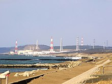
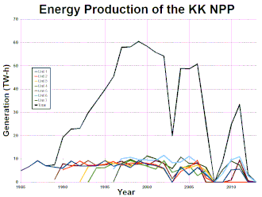
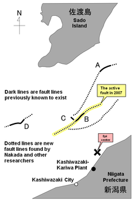
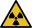

Toggle the table of contents

# Kashiwazaki-Kariwa Nuclear Power Plant

25 languages

* [العربية](https://ar.wikipedia.org/wiki/%D9%85%D8%AD%D8%B7%D8%A9_%DA%A9%D8%A7%D8%B4%DB%8C%D9%88%D8%A7%D8%B2%D8%A7%DA%A9%DB%8C_%DA%A9%D8%A7%D8%B1%DB%8C%D9%88%D8%A7_%D9%84%D9%84%D8%B7%D8%A7%D9%82%D8%A9_%D8%A7%D9%84%D9%86%D9%88%D9%88%D9%8A%D8%A9 "محطة کاشیوازاکی کاریوا للطاقة النووية – Arabic")
* [تۆرکجه](https://azb.wikipedia.org/wiki/%DA%A9%D8%A7%D8%B1%DB%8C%D9%88%D8%A7_-%DA%A9%D8%A7%D8%B4%DB%8C%D9%88%D8%A7%D8%B2%DB%8C_%DA%86%DA%A9%DB%8C%D8%B1%D8%AF%DA%A9_%D8%A7%D9%84%DA%A9%D8%AA%D8%B1%DB%8C%DA%A9_%D9%85%D8%B1%DA%A9%D8%B2%DB%8C "کاریوا -کاشیوازی چکیردک الکتریک مرکزی – South Azerbaijani")
* [Български](https://bg.wikipedia.org/wiki/%D0%90%D0%95%D0%A6_%E2%80%9E%D0%9A%D0%B0%D1%88%D0%B8%D0%B2%D0%B0%D0%B7%D0%B0%D0%BA%D0%B8-%D0%9A%D0%B0%D1%80%D0%B8%D0%B2%D0%B0%E2%80%9C "АЕЦ „Кашивазаки-Карива“ – Bulgarian")
* [Català](https://ca.wikipedia.org/wiki/Central_nuclear_de_Kashiwazaki-Kariwa "Central nuclear de Kashiwazaki-Kariwa – Catalan")
* [Čeština](https://cs.wikipedia.org/wiki/Jadern%C3%A1_elektr%C3%A1rna_Ka%C5%A1iwazaki-Kariwa "Jaderná elektrárna Kašiwazaki-Kariwa – Czech")
* [Deutsch](https://de.wikipedia.org/wiki/Kernkraftwerk_Kashiwazaki-Kariwa "Kernkraftwerk Kashiwazaki-Kariwa – German")
* [Español](https://es.wikipedia.org/wiki/Central_nuclear_de_Kashiwazaki-Kariwa "Central nuclear de Kashiwazaki-Kariwa – Spanish")
* [فارسی](https://fa.wikipedia.org/wiki/%D9%86%DB%8C%D8%B1%D9%88%DA%AF%D8%A7%D9%87_%D9%87%D8%B3%D8%AA%D9%87%E2%80%8C%D8%A7%DB%8C_%DA%A9%D8%A7%D8%B4%DB%8C%D9%88%D8%A7%D8%B2%D8%A7%DA%A9%DB%8C_%DA%A9%D8%A7%D8%B1%DB%8C%D9%88%D8%A7 "نیروگاه هسته‌ای کاشیوازاکی کاریوا – Persian")
* [Français](https://fr.wikipedia.org/wiki/Centrale_nucl%C3%A9aire_de_Kashiwazaki-Kariwa "Centrale nucléaire de Kashiwazaki-Kariwa – French")
* [한국어](https://ko.wikipedia.org/wiki/%EA%B0%80%EC%8B%9C%EC%99%80%EC%9E%90%ED%82%A4_%EA%B0%80%EB%A6%AC%EC%99%80_%EC%9B%90%EC%9E%90%EB%A0%A5_%EB%B0%9C%EC%A0%84%EC%86%8C "가시와자키 가리와 원자력 발전소 – Korean")
* [Italiano](https://it.wikipedia.org/wiki/Centrale_nucleare_di_Kashiwazaki-Kariwa "Centrale nucleare di Kashiwazaki-Kariwa – Italian")
* [Nederlands](https://nl.wikipedia.org/wiki/Kernenergiecentrale_Kashiwazaki-Kariwa "Kernenergiecentrale Kashiwazaki-Kariwa – Dutch")
* [日本語](https://ja.wikipedia.org/wiki/%E6%9F%8F%E5%B4%8E%E5%88%88%E7%BE%BD%E5%8E%9F%E5%AD%90%E5%8A%9B%E7%99%BA%E9%9B%BB%E6%89%80 "柏崎刈羽原子力発電所 – Japanese")
* [Norsk bokmål](https://no.wikipedia.org/wiki/Kashiwazaki-Kariwa_kjernekraftverk "Kashiwazaki-Kariwa kjernekraftverk – Norwegian Bokmål")
* [Polski](https://pl.wikipedia.org/wiki/Elektrownia_j%C4%85drowa_Kashiwazaki-Kariwa "Elektrownia jądrowa Kashiwazaki-Kariwa – Polish")
* [Português](https://pt.wikipedia.org/wiki/Usina_Nuclear_de_Kashiwazaki-Kariwa "Usina Nuclear de Kashiwazaki-Kariwa – Portuguese")
* [Русский](https://ru.wikipedia.org/wiki/%D0%90%D0%AD%D0%A1_%D0%9A%D0%B0%D1%81%D0%B8%D0%B2%D0%B0%D0%B4%D0%B7%D0%B0%D0%BA%D0%B8-%D0%9A%D0%B0%D1%80%D0%B8%D0%B2%D0%B0 "АЭС Касивадзаки-Карива – Russian")
* [Slovenčina](https://sk.wikipedia.org/wiki/Jadrov%C3%A1_elektr%C3%A1re%C5%88_Ka%C5%A1iwazaki-Kariwa "Jadrová elektráreň Kašiwazaki-Kariwa – Slovak")
* [Српски / srpski](https://sr.wikipedia.org/wiki/%D0%9D%D1%83%D0%BA%D0%BB%D0%B5%D0%B0%D1%80%D0%BD%D0%B0_%D0%B5%D0%BB%D0%B5%D0%BA%D1%82%D1%80%D0%B0%D0%BD%D0%B0_%D0%9A%D0%B0%D1%88%D0%B8%D0%B2%D0%B0%D0%B7%D0%B0%D0%BA%D0%B8-%D0%9A%D0%B0%D1%80%D0%B8%D0%B2%D0%B0 "Нуклеарна електрана Кашивазаки-Карива – Serbian")
* [Suomi](https://fi.wikipedia.org/wiki/Kashiwazakin%E2%80%93Kariwan_ydinvoimalaitos "Kashiwazakin–Kariwan ydinvoimalaitos – Finnish")
* [Svenska](https://sv.wikipedia.org/wiki/Kashiwazaki-Kariwa_k%C3%A4rnkraftverk "Kashiwazaki-Kariwa kärnkraftverk – Swedish")
* [Türkçe](https://tr.wikipedia.org/wiki/Kashiwazaki-Kariwa_N%C3%BCkleer_Enerji_Santrali "Kashiwazaki-Kariwa Nükleer Enerji Santrali – Turkish")
* [Українська](https://uk.wikipedia.org/wiki/%D0%90%D0%95%D0%A1_%D0%9A%D0%B0%D1%81%D1%96%D0%B2%D0%B0%D0%B4%D0%B7%D0%B0%D0%BA%D1%96-%D0%9A%D0%B0%D1%80%D1%96%D0%B2%D0%B0 "АЕС Касівадзакі-Каріва – Ukrainian")
* [Tiếng Việt](https://vi.wikipedia.org/wiki/Nh%C3%A0_m%C3%A1y_%C4%91i%E1%BB%87n_h%E1%BA%A1t_nh%C3%A2n_Kashiwazaki-Kariwa "Nhà máy điện hạt nhân Kashiwazaki-Kariwa – Vietnamese")
* [中文](https://zh.wikipedia.org/wiki/%E6%9F%8F%E5%B4%8E%E5%88%88%E7%BE%BD%E6%A0%B8%E8%83%BD%E7%99%BC%E9%9B%BB%E5%BB%A0 "柏崎刈羽核能發電廠 – Chinese")

[Edit links](https://www.wikidata.org/wiki/Special:EntityPage/Q725100#sitelinks-wikipedia "Edit interlanguage links")

* [Article](/wiki/Kashiwazaki-Kariwa_Nuclear_Power_Plant "View the content page [c]")
* [Talk](/wiki/Talk:Kashiwazaki-Kariwa_Nuclear_Power_Plant "Discuss improvements to the content page [t]")

English

* [Read](/wiki/Kashiwazaki-Kariwa_Nuclear_Power_Plant)
* [Edit](/w/index.php?title=Kashiwazaki-Kariwa_Nuclear_Power_Plant&action=edit "Edit this page [e]")
* [View history](/w/index.php?title=Kashiwazaki-Kariwa_Nuclear_Power_Plant&action=history "Past revisions of this page [h]")

Tools

Tools
move to sidebar
hide

 Actions
 

* [Read](/wiki/Kashiwazaki-Kariwa_Nuclear_Power_Plant)
* [Edit](/w/index.php?title=Kashiwazaki-Kariwa_Nuclear_Power_Plant&action=edit "Edit this page [e]")
* [View history](/w/index.php?title=Kashiwazaki-Kariwa_Nuclear_Power_Plant&action=history)

 General
 

* [What links here](/wiki/Special:WhatLinksHere/Kashiwazaki-Kariwa_Nuclear_Power_Plant "List of all English Wikipedia pages containing links to this page [j]")
* [Related changes](/wiki/Special:RecentChangesLinked/Kashiwazaki-Kariwa_Nuclear_Power_Plant "Recent changes in pages linked from this page [k]")
* [Upload file](/wiki/Wikipedia:File_Upload_Wizard "Upload files [u]")
* [Special pages](/wiki/Special:SpecialPages "A list of all special pages [q]")
* [Permanent link](/w/index.php?title=Kashiwazaki-Kariwa_Nuclear_Power_Plant&oldid=1254425577 "Permanent link to this revision of this page")
* [Page information](/w/index.php?title=Kashiwazaki-Kariwa_Nuclear_Power_Plant&action=info "More information about this page")
* [Cite this page](/w/index.php?title=Special:CiteThisPage&page=Kashiwazaki-Kariwa_Nuclear_Power_Plant&id=1254425577&wpFormIdentifier=titleform "Information on how to cite this page")
* [Get shortened URL](/w/index.php?title=Special:UrlShortener&url=https%3A%2F%2Fen.wikipedia.org%2Fwiki%2FKashiwazaki-Kariwa_Nuclear_Power_Plant)
* [Download QR code](/w/index.php?title=Special:QrCode&url=https%3A%2F%2Fen.wikipedia.org%2Fwiki%2FKashiwazaki-Kariwa_Nuclear_Power_Plant)

 Print/export
 

* [Download as PDF](/w/index.php?title=Special:DownloadAsPdf&page=Kashiwazaki-Kariwa_Nuclear_Power_Plant&action=show-download-screen "Download this page as a PDF file")
* [Printable version](/w/index.php?title=Kashiwazaki-Kariwa_Nuclear_Power_Plant&printable=yes "Printable version of this page [p]")

 In other projects
 

* [Wikimedia Commons](https://commons.wikimedia.org/wiki/Category:Kashiwazaki-Kariwa_Nuclear_Power_Plant)
* [Wikidata item](https://www.wikidata.org/wiki/Special:EntityPage/Q725100 "Structured data on this page hosted by Wikidata [g]")

Appearance
move to sidebar
hide

[Coordinates](/wiki/Geographic_coordinate_system "Geographic coordinate system"): .mw-parser-output .geo-default,.mw-parser-output .geo-dms,.mw-parser-output .geo-dec{display:inline}.mw-parser-output .geo-nondefault,.mw-parser-output .geo-multi-punct,.mw-parser-output .geo-inline-hidden{display:none}.mw-parser-output .longitude,.mw-parser-output .latitude{white-space:nowrap}[37°25′42″N 138°36′06″E / 37.42833°N 138.60167°E / 37.42833; 138.60167](https://geohack.toolforge.org/geohack.php?pagename=Kashiwazaki-Kariwa_Nuclear_Power_Plant&params=37_25_42_N_138_36_06_E_region:JP-15_type:landmark)

From Wikipedia, the free encyclopedia

Nuclear power plant in Niigata Prefecture, Japan
.mw-parser-output .ambox{border:1px solid #a2a9b1;border-left:10px solid #36c;background-color:#fbfbfb;box-sizing:border-box}.mw-parser-output .ambox+link+.ambox,.mw-parser-output .ambox+link+style+.ambox,.mw-parser-output .ambox+link+link+.ambox,.mw-parser-output .ambox+.mw-empty-elt+link+.ambox,.mw-parser-output .ambox+.mw-empty-elt+link+style+.ambox,.mw-parser-output .ambox+.mw-empty-elt+link+link+.ambox{margin-top:-1px}html body.mediawiki .mw-parser-output .ambox.mbox-small-left{margin:4px 1em 4px 0;overflow:hidden;width:238px;border-collapse:collapse;font-size:88%;line-height:1.25em}.mw-parser-output .ambox-speedy{border-left:10px solid #b32424;background-color:#fee7e6}.mw-parser-output .ambox-delete{border-left:10px solid #b32424}.mw-parser-output .ambox-content{border-left:10px solid #f28500}.mw-parser-output .ambox-style{border-left:10px solid #fc3}.mw-parser-output .ambox-move{border-left:10px solid #9932cc}.mw-parser-output .ambox-protection{border-left:10px solid #a2a9b1}.mw-parser-output .ambox .mbox-text{border:none;padding:0.25em 0.5em;width:100%}.mw-parser-output .ambox .mbox-image{border:none;padding:2px 0 2px 0.5em;text-align:center}.mw-parser-output .ambox .mbox-imageright{border:none;padding:2px 0.5em 2px 0;text-align:center}.mw-parser-output .ambox .mbox-empty-cell{border:none;padding:0;width:1px}.mw-parser-output .ambox .mbox-image-div{width:52px}@media(min-width:720px){.mw-parser-output .ambox{margin:0 10%}}@media print{body.ns-0 .mw-parser-output .ambox{display:none!important}}||
||

.mw-parser-output .infobox-subbox{padding:0;border:none;margin:-3px;width:auto;min-width:100%;font-size:100%;clear:none;float:none;background-color:transparent}.mw-parser-output .infobox-3cols-child{margin:auto}.mw-parser-output .infobox .navbar{font-size:100%}body.skin-minerva .mw-parser-output .infobox-header,body.skin-minerva .mw-parser-output .infobox-subheader,body.skin-minerva .mw-parser-output .infobox-above,body.skin-minerva .mw-parser-output .infobox-title,body.skin-minerva .mw-parser-output .infobox-image,body.skin-minerva .mw-parser-output .infobox-full-data,body.skin-minerva .mw-parser-output .infobox-below{text-align:center}@media screen{html.skin-theme-clientpref-night .mw-parser-output .infobox-full-data:not(.notheme)>div:not(.notheme)[style]{background:#1f1f23!important;color:#f8f9fa}}@media screen and (prefers-color-scheme:dark){html.skin-theme-clientpref-os .mw-parser-output .infobox-full-data:not(.notheme) div:not(.notheme){background:#1f1f23!important;color:#f8f9fa}}@media(min-width:640px){body.skin--responsive .mw-parser-output .infobox-table{display:table!important}body.skin--responsive .mw-parser-output .infobox-table>caption{display:table-caption!important}body.skin--responsive .mw-parser-output .infobox-table>tbody{display:table-row-group}body.skin--responsive .mw-parser-output .infobox-table tr{display:table-row!important}body.skin--responsive .mw-parser-output .infobox-table th,body.skin--responsive .mw-parser-output .infobox-table td{padding-left:inherit;padding-right:inherit}}|Kashiwazaki-Kariwa Nuclear Power Plant|Country|Location|Coordinates|Status|Construction began|Commission date|Operator|Cooling source|Power generation|Units operational|Nameplate capacity|Capacity factor|Annual net output|External links|Website|Commons|
|---|---|---|---|---|---|---|---|---|---|---|---|---|---|---|---|---|

The **Kashiwazaki-Kariwa Nuclear Power Plant** (柏崎刈羽原子力発電所, *Kashiwazaki-Kariwa genshiryoku-hatsudensho*, Kashiwazaki-Kariwa NPP) is a large, modern (housing the world's first [advanced boiling water reactor](/wiki/Advanced_boiling_water_reactor "Advanced boiling water reactor") or ABWR) [nuclear power](/wiki/Nuclear_power "Nuclear power") plant on a 4.2-square-kilometer (1,000-acre) site.[[1]](#cite_note-:0-1) The campus spans the towns of [Kashiwazaki](/wiki/Kashiwazaki,_Niigata "Kashiwazaki, Niigata") and [Kariwa](/wiki/Kariwa,_Niigata "Kariwa, Niigata") in [Niigata Prefecture](/wiki/Niigata_Prefecture "Niigata Prefecture"), [Japan](/wiki/Japan "Japan"), on the coast of the [Sea of Japan](/wiki/Sea_of_Japan "Sea of Japan"), where it gets cooling water. The plant is owned and operated by [Tokyo Electric Power Company](/wiki/Tokyo_Electric_Power_Company "Tokyo Electric Power Company") (TEPCO), and it is the [largest nuclear generating station](/wiki/List_of_nuclear_power_stations "List of nuclear power stations") in the world by net [electrical power](/wiki/Electrical_power "Electrical power") rating.

On 16 July 2007, the [Chūetsu offshore earthquake](/wiki/2007_Ch%C5%ABetsu_offshore_earthquake "2007 Chūetsu offshore earthquake") took place, with its epicenter located only 19 km (12 mi) from the plant. The earthquake registered [Mw](/wiki/Moment_magnitude_scale "Moment magnitude scale") 6.6, ranking it among the strongest earthquakes to occur in the immediate range of a nuclear power plant.[[1]](#cite_note-:0-1) This shook the plant beyond design basis and initiated an extended shutdown for inspection, which indicated that greater earthquake-proofing was needed before the operation could be resumed. The plant was completely shut down for 21 months following the earthquake. Unit 7 was restarted after seismic upgrades on 19 May 2009, followed later by units 1, 5, and 6. (Units 2, 3, and 4 were not restarted by the time of the March 2011 earthquake.)

The four restarted and operating units at the plant were not affected by the [11 March 2011 earthquake](/wiki/2011_T%C5%8Dhoku_earthquake_and_tsunami "2011 Tōhoku earthquake and tsunami"), but thereupon all units were shut down to carry out safety improvements. TEPCO regained permission to restart units 6 and 7 from the [Nuclear Regulation Authority](/wiki/Nuclear_Regulation_Authority "Nuclear Regulation Authority") (NRA) in 2017,[[2]](#cite_note-2) but throughout 2023, all units remained idle. In December 2023, the NRA finally approved the reloading of fuel at the plant, citing improvements in the safety management system.[[3]](#cite_note-ban-lifted-3) As of 2024, TEPCO is seeking permission from local authorities to restart the plant again.

## Reactors

There are seven reactor units spread across the campus coast line. Numbering starts at Unit 1 with the south-most unit through Unit 4, then there is a large green space in between Unit 4 and 7, then it continues with Units 6 and 5.[[4]](#cite_note-4)

The Kashiwazaki-Kariwa Nuclear Power Plant, a nuclear plant with seven units, the largest single nuclear power station in the world, was completely shut down for 21 months following an earthquake in 2007.[[5]](#cite_note-mycle-5)
||KK – 1|KK – 2|KK – 3|KK – 4|KK – 5|KK – 6|KK – 7|
|---|---|---|---|---|---|---|---|
|Reactor Type|BWR|BWR|BWR|BWR|BWR|ABWR|ABWR|
|Net Power (MW)|1,067|1,067|1,067|1,067|1,067|1,315|1,315|
|Gross Power (MW)|1,100|1,100|1,100|1,100|1,100|1,356|1,356|
|Start of Construction|5 June 1980|18 November 1985|7 March 1989|5 March 1990|20 June 1985|3 November 1992|1 July 1993|
|First Criticality|12 December 1984|30 November 1989|19 October 1992|1 November 1993|20 July 1989|18 December 1995|1 November 1996|
|Commission date|18 September 1985|28 September 1990|11 August 1993|11 August 1994|10 April 1990|7 November 1996|2 July 1997|
|Installation Costs(1,000 yen/kW)|330|360|310|310|420|310|280[6]|
|Reactor/NSSS Supplier|Toshiba|Toshiba|Toshiba|Hitachi|Hitachi|Hitachi/Toshiba/GE|Hitachi/Toshiba/GE|

The power installation costs for units at this site well reflect the general trend in costs of nuclear plants. Capital costs increased through the 1980s but have become cheaper in modern times. The last two units were the first [Advanced Boiling Water Reactors](/wiki/Advanced_Boiling_Water_Reactor "Advanced Boiling Water Reactor") (ABWRs) ever built.

### Performance

Despite frequent changes in performance year to year due to routine outages, the entire plant operated at almost continuous power output until the plant-wide events of the 2000s.
Operating a single large plant comprising this many reactors has several economic advantages. One such benefit is the limited impact of single-reactor [refueling outages](/wiki/Refueling_outage "Refueling outage") during the replacement cycle; one dormant reactor makes minimal impact on the plant's net power production. A smooth transition was seen in the power production history of the plant up through the time the last two units were built. Currently, however, there are no active reactors at the Kashiwazaki-Kariwa plant. TEPCO has outlined plans to restart Reactor 6 and Reactor 7 and is awaiting approval from the government and citizens before the reactors are permitted to restart.[[7]](#cite_note-7)

|Year|Unit 1|Unit 2|Unit 3|Unit 4|Unit 5|Unit 6|Unit 7|Total|
|---|---|---|---|---|---|---|---|---|
|1985|4.960|||||||4.960|
|1986|6.704|||||||6.704|
|1987|9.195|||||||9.195|
|1988|6.960|||||||6.960|
|1989|6.442||||1.041|||7.484|
|1990|5.987|5.386|||7.911|||19.284|
|1991|9.032|6.642|||7.093|||22.767|
|1992|6.958|9.047|0.053||6.977|||23.035|
|1993|6.874|7.213|6.488|0.012|9.238|||29.825|
|1994|7.020|7.291|7.264|6.040|7.155|||34.771|
|1995|9.235|7.697|9.254|6.182|7.508|||39.877|
|1996|6.814|8.811|7.922|8.068|7.906|5.663|0.058|45.242|
|1997|7.900|7.284|8.016|7.517|8.919|10.161|8.128|57.926|
|1998|6.176|8.142|6.748|9.259|7.353|10.702|9.716|58.095|
|1999|9.199|8.209|9.028|8.142|7.772|9.710|8.445|60.505|
|2000|7.715|8.140|7.945|6.919|7.043|9.412|11.240|58.413|
|2001|7.071|7.595|6.986|5.591|9.199|9.270|10.078|55.790|
|2002|5.906|5.866|5.576|9.240|8.191|11.504|7.990|54.273|
|2003|0.000|0.000|0.000|4.186|1.503|8.401|5.778|19.869|
|2004|6.497|4.660|6.550|5.624|6.135|8.635|10.805|48.906|
|2005|3.126|6.388|6.062|7.192|6.853|11.126|7.977|48.725|
|2006|6.299|9.331|7.331|2.817|8.400|8.447|8.166|50.792|
|2007|3.165|1.830|5.054|5.061|0.0|3.758|6.358|25.226|
|2008|0.0|0.0|0.0|0.0|0.0|0.0|0.0|0.0|
|2009|0.0|0.0|0.0|0.0|0.0|3.654|5.366|9.02|
|2010|5.291|0.0|0.0|0.0|0.780|9.522|9.034|24.627|
|2011|5.606|0.0|0.0|0.0|9.402|10.960|7.349|33.317|
|2012|0.0|0.0|0.0|0.0|0.0|0.0|0.0|0.0|
|2013|0.0|0.0|0.0|0.0|0.0|0.0|0.0|0.0|
|2014|0.0|0.0|0.0|0.0|0.0|0.0|0.0|0.0|
|2015|0.0|0.0|0.0|0.0|0.0|0.0|0.0|0.0|
|2016|0.0|0.0|0.0|0.0|0.0|0.0|0.0|0.0|
|2017|0.0|0.0|0.0|0.0|0.0|0.0|0.0|0.0|
|2018|0.0|0.0|0.0|0.0|0.0|0.0|0.0|0.0|
|2019|0.0|0.0|0.0|0.0|0.0|0.0|0.0|0.0|
|2020|0.0|0.0|0.0|0.0|0.0|0.0|0.0|0.0|
|2021|0.0|0.0|0.0|0.0|0.0|0.0|0.0|0.0|

### Partial shutdowns

In February 1991, Unit 2 was automatically shut down following a sudden drop in oil pressure inside the steam turbine.[[8]](#cite_note-8)

On 18 July 1997, radioactive steam leaked from a gauge within Unit 7 of the Kashiwazaki-Kariwa plant. In May, a burst tube had delayed trial runs at the plant, and earlier in July smoke had been found coming from plant machinery.[[9]](#cite_note-9)

In January 1998, Unit 1 was shut down after increasing radiation levels in the steam driving the turbine triggered alarms. The levels were reportedly 270 times the expected operating level.[[10]](#cite_note-10)

Reactors at the plant were shut down one by one following the 2002 discovery that TEPCO had deliberately falsified data surrounding safety inspections.[[11]](#cite_note-11) The first reactor was taken offline 9 September 2002, and the final reactor was taken offline 27 January 2003.[[12]](#cite_note-12) The newest units, the more inherently safe ABWRs, were taken back online the quickest and suffered the smallest effect. Units 1, 2, and 3, on the other hand, generated no electricity during the fiscal year of 2003.

### Complete shutdowns

Units 1-4 were completely shut down in 2008. Only Unit 1 was temporarily restarted in 2010–2011. Unit 5 was temporarily restarted between 2010 and 2012 after a shut down in 2007.
Following the [Fukushima disaster](/wiki/Fukushima_Daiichi_nuclear_disaster "Fukushima Daiichi nuclear disaster") in 2011, Unit 1 was shut down again in 2012 along with units 5–7. As of May 2022, the plant remains idle.[[13]](#cite_note-kashiwazaki-shutdowns-13)

## Fuel

All reactors continue to use low-enriched [uranium](/wiki/Uranium "Uranium") as the nuclear fuel; however, there have been plans drafted by [TEPCO](/wiki/TEPCO "TEPCO") to use [MOX fuel](/wiki/MOX_fuel "MOX fuel") in some of the reactors by the permission of the [Japanese Atomic Energy Commission](/wiki/Japanese_Atomic_Energy_Commission "Japanese Atomic Energy Commission") (JAEC). A public referendum in the Kariwa village in 2001 voted 53% against use of the new fuel. After the 2002 TEPCO data fabrication scandals, the president at the time, [Nobuya Minami](/w/index.php?title=%E5%8D%97%E7%9B%B4%E5%93%89_(%E5%AE%9F%E6%A5%AD%E5%AE%B6)&action=edit&redlink=1 "南直哉 (実業家) (page does not exist)") [[jp](https://ja.wikipedia.org/wiki/%E5%8D%97%E7%9B%B4%E5%93%89_(%E5%AE%9F%E6%A5%AD%E5%AE%B6) "jp:南直哉 (実業家)")], announced that plans to use the MOX fuel at the KK plant would be suspended indefinitely.

## Earthquakes

.mw-parser-output .hatnote{font-style:italic}.mw-parser-output div.hatnote{padding-left:1.6em;margin-bottom:0.5em}.mw-parser-output .hatnote i{font-style:normal}.mw-parser-output .hatnote+link+.hatnote{margin-top:-0.5em}@media print{body.ns-0 .mw-parser-output .hatnote{display:none!important}}See also: [Nuclear power in Japan § Seismicity](/wiki/Nuclear_power_in_Japan#Seismicity "Nuclear power in Japan")
||
||

### Earthquake resistant design features

Sand at the sites was removed and the reactor was built on firm ground. Adjacent soil was backfilled. Basements of the reactor buildings extend several levels down (maximum of 42 m below grade).[[14]](#cite_note-TCLEE_#31-14) These underground elements stabilize the reactor buildings, making them less likely to suffer sway due to resonance vibrations during an earthquake. As with other Japanese power plants, reactors at the plant were built according to earthquake-resistance standards, which are regulated by law and the JAEC.

In 2006 safety standards for earthquake resistance in Japan's nuclear plants were modified and tightened. After the 2007 earthquake suspicions arose that another fault line may be closer to the plant than originally thought, possibly running straight through the site.

### 2007 Chūetsu offshore earthquake

||
||

The offshore fault lines near the plant. Some faults were discovered through research after the major earthquake while some were known before.
The KK plant was 19 kilometers away from the epicenter of the [magnitude](/wiki/Moment_magnitude_scale "Moment magnitude scale") 6.6 [2007 Chūetsu offshore earthquake](/wiki/2007_Ch%C5%ABetsu_offshore_earthquake "2007 Chūetsu offshore earthquake"), which took place 10:13 a.m., 16 July 2007. [Peak ground acceleration](/wiki/Peak_ground_acceleration "Peak ground acceleration") of 6.8 m/s2 (0.69 *g*) was recorded in Unit 1 in the east–west direction, above the design specification for safe shutdown of 4.5 m/s2, and well above the rapid restart specification for key equipment in the plant of 2.73 m/s2.[[15]](#cite_note-15) Units 5 and 6 also recorded shaking over this limit.[[16]](#cite_note-16) Shaking of 20.58 m/s2 was recorded in the turbine building of Unit 3.[[17]](#cite_note-17)

Those nearby saw black smoke which was later confirmed to be an electric transformer that had caught fire at Unit 3.[[18]](#cite_note-18)[[19]](#cite_note-xin-19) The fire was put out by noon on the day of the quake, about 2 hours after it started. The 3-story transformer building was extensively charred.[[20]](#cite_note-20)

Reactor units 3, 4, and 7 all automatically powered down safely in response to the quake. Unit 2 was in startup mode and not online.[[14]](#cite_note-TCLEE_#31-14) Units 1, 5, and 6 were already shut down for inspection at the time.[[21]](#cite_note-21) TEPCO was ready to restart some of the units as of the next day, but the [trade ministry](/wiki/Ministry_of_Economy,_Trade_and_Industry "Ministry of Economy, Trade and Industry") ordered the plant to remain idle until additional safety checks could be completed. On Wednesday, 18 July, the mayor of Kashiwazaki ordered operations at the plant to be halted until its safety could be confirmed.[[22]](#cite_note-IHT07-07-18-22) [The *Nikkei*](/wiki/Nihon_Keizai_Shimbun "Nihon Keizai Shimbun") reported that government safety checks could delay the restart for over a year, without stating the source of the information.[[23]](#cite_note-Reuters070719-23) For comparison, in 2005, a reactor at the [Onagawa Nuclear Power Plant](/wiki/Onagawa_Nuclear_Power_Plant "Onagawa Nuclear Power Plant") was closed for five months following an earthquake.[[23]](#cite_note-Reuters070719-23)

#### IAEA inspections

The [International Atomic Energy Agency](/wiki/International_Atomic_Energy_Agency "International Atomic Energy Agency") (IAEA) offered to inspect the plant, which was initially declined. The governor of [Niigata prefecture](/wiki/Niigata_prefecture "Niigata prefecture") then sent a petition to [Shinzo Abe](/wiki/Shinzo_Abe "Shinzo Abe"). On Sunday, 22 July 2007, the [Nuclear and Industrial Safety Agency](/wiki/Nuclear_and_Industrial_Safety_Agency "Nuclear and Industrial Safety Agency") (NISA) announced that it would allow inspectors from the United Nations to review the damage.[[24]](#cite_note-24)

A team from the IAEA carried out a four-day inspection, as investigations by Japan's Nuclear and Industrial Safety Agency (NISA), Nuclear Safety Commission (NSC) and the Tokyo Electric Power Company (TEPCO) continued.[[25]](#cite_note-25) The team of the IAEA confirmed that the plant had "shut down safely" and that "damage appears less than expected."[[26]](#cite_note-wnn-26) On 19 August, the IAEA reported that, for safety-related and nuclear components, "no visible significant damage has been found" although "nonsafety related structures, systems and components were affected by significant damage".[[27]](#cite_note-27)

The official report issued by the IAEA stated that the plant "behaved in a safe manner" after a 4-day inspection. Other observations were:

* "Safety related structures, systems and components of the plant seem to be in a general condition, much better than might be expected for such a strong earthquake, and there is no visible significant damage"
* Conservatisms introduced in the construction of the plant compensated for the magnitude of the earthquake being so much greater than planned for.

Recommendations included:

* A re-evaluation of the seismic safety.
* Detailed geophysical investigations[[28]](#cite_note-28)

External inspections of the plant were planned to be completed by the end of July 2008. The schedule was confirmed on 10 July 2008 by the site superintendent, Akio Takahashi. On 15 July, [Akira Amari](/wiki/Akira_Amari "Akira Amari") said his ministry was also continuing their own tests. An IAEA workshop in June 2008 recognized that the earthquake exceeded the "seismic input" used in the design in that plant, and that regulations played a critical role in keeping the plant safe.[[29]](#cite_note-29) However, TEPCO determined that significant upgrades were required to cope with the improved understanding of the seismic environment and possible shaking effects at the plant site.

The IAEA sent a team for a follow-up visit in January 2008. They concluded that much high-quality inspection work had been undertaken and noted the likely improvements to nuclear seismic design worldwide that may result from this process.[[30]](#cite_note-IAEA2-30) An additional visit from an IAEA team of 10 experts occurred in December 2008, noting that the "unexpectedly large ground motions" were now well understood and could be protected against, and further confirming the safe performance of the plant during the quake.[[31]](#cite_note-IAEA3-31)[[32]](#cite_note-IAEA3A-32)

#### Radioactivity releases

Initially, it was thought that some water (estimated to be about 1.5 L) from the [spent fuel pool](/wiki/Spent_fuel_pool "Spent fuel pool") leaked into the [Sea of Japan](/wiki/Sea_of_Japan "Sea of Japan") as a result of the quake.[[33]](#cite_note-33)[[34]](#cite_note-34) Later, more detailed reports confirmed a number of releases, though most of them were far less active than common natural radiation sources. According to the NISA, this was the first time a release of radioactive material happened as a result of an earthquake.

* 0.6 litres of slightly radioactive water leaked from the third floor of the Unit 6 reactor building, which contained 280 [becquerels](/wiki/Becquerel "Becquerel") of radioactivity. (For reference, a household smoke detector typically contains 37,000 becquerels (1.0 μCi) of radioactivity,[[35]](#cite_note-35) and a living adult human typically has around 8000 Bq of naturally occurring radioactivity inside their body).
* 0.9 litres of slightly radioactive water leaked from the inner third floor of the Unit 6 reactor building, containing 16,000 Bq of radioactivity.
* From unit 6, 1.3 cubic meters of water from the spent fuel pool leaked through a drainage pipe and ultimately into the Sea of Japan. The water contained 80 Bq/[L](/wiki/Litre "Litre"), totaling 90,000 Bq in the release.[[36]](#cite_note-36) For comparison, an [Onsen](/wiki/Onsen "Onsen") located in [Misasa, Tottori](/wiki/Misasa,_Tottori "Misasa, Tottori"), [Japan](/wiki/Japan "Japan") uses water with a large concentration of [radon](/wiki/Radon "Radon"), which gives it a radioactivity of 9300 Bq/L. The leaked water from the plant did not pose a health risk even before being diluted. Towels were used to mop up the water.[[37]](#cite_note-37)
* On Wednesday, 18 July 2007, at Unit 7, radioactive [iodine](/wiki/Iodine "Iodine") was found leaking from an exhaust pipe by a government inspector, the leak began between Tuesday and Wednesday and was confirmed to have stopped by Thursday night. The amount of iodine released was estimated at 12 million Bq and the total amount of particulate radioactivity released into the air was about 402,000,000 Bq.[[38]](#cite_note-38) This was said to have been one 10 millionth of the legal limit.[[39]](#cite_note-39) It is estimated that this caused an unintentional dose of 0.0002 [nanosieverts](/wiki/Nanosievert "Nanosievert") (nSv), per person distributed among around 10 million people. The limit for dose to the public from the operations of a nuclear plant in Japan in one year is 1100 nSv, and, for comparison, [natural background radiation](/wiki/Natural_background_radiation "Natural background radiation") worldwide for humans is on average around 2,400,000 nSv/year (2.4 mSv/year). In regards to the cause, [Yasuhisa Shiozaki](/wiki/Yasuhisa_Shiozaki "Yasuhisa Shiozaki") said "This is an error of not implementing the manual," because the vent should have been closed.[[40]](#cite_note-40)

#### Other problems

About 400 drums containing low-level nuclear waste stored at the plant were knocked over by the [aftershocks](/wiki/Aftershock "Aftershock"), 40 losing their lids.[[41]](#cite_note-41) Company officials reported on 17 July that traces of the radioactive materials [cobalt-60](/wiki/Cobalt-60 "Cobalt-60"), iodine, and [chromium-51](/wiki/Chromium-51 "Chromium-51") had been released into the atmosphere, presumably from the containers losing their lids.

Criticisms of the company's response to the event included the time it took the company to report events and the certainty with which they were able to locate the source of various problems. TEPCO's president made a comment the site was a "mess"[[42]](#cite_note-ndtv-42) after visiting post-quake. While the reported amount of leaked radioactivity remained far below what poses a danger to the public, details changed multiple times in the few days after the quake and attracted significant media attention. After the quake, TEPCO was supposedly investigating 50 separate cases of "malfunctioning and trouble,"[[43]](#cite_note-IHT-43) a number that was changed to 63 cases later.[[44]](#cite_note-44) Even the radioactivity sensors around the site encountered trouble, the reading from these devices are normally available online, giving the public a direct measure of ambient radioactivity around the site, but due to damage sustained during the earthquake, stopped reporting on the website. The company published an apology on that page, and data from the devices covering the off-line period was released later, showing no artificial abnormalities (note that the readings naturally fluctuate depending on whether it's raining or snowing and a host of other factors).[[45]](#cite_note-45)

TEPCO's president maintained that fears of a leak of radioactive material were unfounded (since the amount leaked into the ocean was a billionth of the legal limit), but many international reporters expressed distrust of the company that has a history of cover-up controversies. The IAEA's [Mohamed ElBaradei](/wiki/Mohamed_ElBaradei "Mohamed ElBaradei") encouraged full transparency throughout the investigation of the accident so that lessons learned could be applied to nuclear plants elsewhere.[[42]](#cite_note-ndtv-42)

#### Impact

News of the earthquake, combined with the fact that replacement power sources (such as oil and gas) are at record highs, caused TEPCOs stock to plummet 7.5%, the largest drop in seven years, which amounted to around US$4.4 billion lost in stock capitalization.[[46]](#cite_note-46) This made the event even more costly to the company than the [2002 data falsification scandal](/wiki/Tokyo_Electric_Power_Company#Safety_incidents "Tokyo Electric Power Company"). Additionally, TEPCO warned that the plant closure could cause a power shortage during the summer months.[[43]](#cite_note-IHT-43) Trade minister [Akira Amari](/wiki/Akira_Amari "Akira Amari") requested that business users cut electricity use,[[47]](#cite_note-47) and in August TEPCO was forced to reduce electricity supplies for industrial uses, the first time it had to resort to such measures in 17 years.[[48]](#cite_note-NEI-20070914-48)

Reports of the leak caused thousands of cancellations at resorts and hotels along the [Sea of Japan](/wiki/Sea_of_Japan "Sea of Japan") coast, even as far as [Murakami, Niigata](/wiki/Murakami,_Niigata "Murakami, Niigata") (140 km northeast) and [Sado Island](/wiki/Sado_Island "Sado Island"). Inn owners have said that rumors have been more damaging than direct effects of the earthquake.[[49]](#cite_note-49)

The shutdown forced TEPCO to run [natural gas](/wiki/Natural_gas "Natural gas") plants in place of this plant, not only increasing Japan's demand for the fuel and increasing the price internationally, but also increasing carbon dioxide output such that Japan will have difficulty meeting the [Kyoto Protocol](/wiki/Kyoto_Protocol "Kyoto Protocol").

#### Restart

After 16 months of comprehensive component-based assessment and upgrades on all seven reactors, this phase of post-earthquake response was almost complete, with Reactor 7 fully upgraded to cope with the seismic environment. On 8 November 2008, fuel loading in reactor Unit 7 started, preparatory to a period of system safety tests on that reactor.[[50]](#cite_note-50) On 19 February 2009 TEPCO applied to the local governance to restart Unit 7 after having obtained approval from the national government and regulators.[[51]](#cite_note-51) Local government agreement for restart was granted in May[[52]](#cite_note-52) and electrical grid power was supplied from Unit 7 at 20% power on 19 May.[[53]](#cite_note-53) The reactor was raised to 100% power on 5 June 2009 as part of a series of restart tests.[[54]](#cite_note-54)

Unit 6 restarted on 26 August 2009[[55]](#cite_note-55) and reconnected to the grid on 31 August.[[56]](#cite_note-56)

Unit 1 restarted on 31 May 2010[[57]](#cite_note-57) after loading with fuel (along with Unit 5) earlier in the year, and was generating grid power by 6 June 2010.[[58]](#cite_note-58)

Unit 5 recommenced grid generation on 26 November 2010, in the same week that fuel loading for Unit 3 started.[[59]](#cite_note-59)

Units 2, 3, and 4 were not restarted. 

### 2011 Tōhoku earthquake

The reactors were shut down indefinitely following the [2011 Tōhoku earthquake and tsunami](/wiki/2011_T%C5%8Dhoku_earthquake_and_tsunami "2011 Tōhoku earthquake and tsunami"). Plans to restart units 6 and 7 were delayed after problems developed with the intruder detection system.[[60]](#cite_note-nippon.com-60)

### Facility improvements after Fukushima I nuclear accidents

On 21 April 2011, after the [Fukushima Daiichi nuclear disaster](/wiki/Fukushima_Daiichi_nuclear_disaster "Fukushima Daiichi nuclear disaster"), TEPCO announced a plan to build up the [seawall](/wiki/Seawall "Seawall") to a height of 15 m (49.2 ft) above [sea level](/wiki/Sea_level "Sea level") and spanning more than 800 m (2,624 ft) in length for units 1–4, and more than 500 m (1,640 ft) for units 5–7 by June 2013. The height of a potential [tsunami](/wiki/Tsunami "Tsunami") was assumed to be 3.3 m. Also, plans were made to rebuild the radioactive overflow storage pool to be completed by September 2012.[[61]](#cite_note-61)

### 2011–2012: Survey on tsunamis in the past

On 10 November 2011, TEPCO announced a survey for signs of past tsunamis in this area. With drills, soil samples were to be taken of sediment layers dating from the year 1600 back to 7000 years ago, at nine locations around the plant at the coast of central Japan. This survey, the first that TEPCO ever conducted on this subject, did start on 15 November 2011, and was planned to be completed in April 2012, and was done to examine the possibility of higher tsunamis than had been expected at the time the plant was designed and built.[[62]](#cite_note-62)

On 26 April 2012, TEPCO said that it would recalculate the risks of earthquakes and tsunamis. This was done after reports, as published by four prefectures around the nuclear Plant, re-estimated the risks of potential earthquakes in the region:

* [Tottori Prefecture](/wiki/Tottori_Prefecture "Tottori Prefecture"): a 220 kilometer long fault might trigger an 8.15 magnitude earthquake
* [Shimane Prefecture](/wiki/Shimane_Prefecture "Shimane Prefecture"): 8.01 magnitude
* [Ishikawa Prefecture](/wiki/Ishikawa_Prefecture "Ishikawa Prefecture"): 7.99 magnitude

The calculated earthquake magnitudes are almost three times stronger than all the calculations done by TEPCO regarding the safety assessments for the plant. These were based on a magnitude 7.85 quake caused by a 131 kilometer long fault near [Sado Island](/wiki/Sado_Island "Sado Island") in Niigata and a 3.3 meter-high tsunami. To endure this, an embankment was under construction to resist tsunami waves up to 15 meters high. The recalculation could have consequences for the stress tests and safety assessments for the plant.[[63]](#cite_note-63)

After the planned revision of the safety standards in July 2013, some faults under the reactors were considered as geologically active. This was found by Japanese news agency [Kyodo News](/wiki/Kyodo_News "Kyodo News") on 23 January 2013 in papers and other material published by TEPCO. Under the new regulations, geologic faults would be considered to be active if they had moved within the last 400,000 years, instead of the less stringent standard of 120 000 years, as was formerly accepted.

Two faults, named "Alpha" and "Beta," are present under Reactors 1 and 2. Other faults are situated under Reactor 3 and Reactor 5, as well as underneath the building of Reactor 4. Under the new regulations, the beta-fault could be classified as active because it moved a ground layer including volcanic ash around 240,000 years ago. The outcome of the study might trigger a second survey by the newly installed Japanese regulator NRA. In January 2013, studies were conducted or planned on geological faults around six Japanese reactor sites. The Kashiwazaki-Kariwa plant would be number seven.[[64]](#cite_note-64)

## Current status

In 2017, TEPCO contempleted a restart of the plant from 2019 to 2021.[[65]](#cite_note-65)

Kashiwazaki-Kariwa is one of the 44 [nuclear power plants in Japan](/wiki/Nuclear_power_in_Japan "Nuclear power in Japan") that have been rendered inactive in the years following the Fukushima Daiichi Accident. By October 2020, the Japanese government had inspected the plant, and by January 2020, TEPCO had completed its improvements on Unit 7. The company outlined plans to restart the reactor as early as the end of the Japanese 2022 [Fiscal year](/wiki/Fiscal_year "Fiscal year") (31 March 2022). However, the [Nuclear Regulation Authority](/wiki/Nuclear_Regulation_Authority "Nuclear Regulation Authority") released a report in April 2021 indicating that there were serious security infractions and enacted an order that postponed the restart indefinitely.[[60]](#cite_note-nippon.com-60)[[66]](#cite_note-asahi.com-66)[[67]](#cite_note-67)

Following the April 2021 NRA report, TEPCO admitted that its intruder detection system was left broken in order to reduce costs[[68]](#cite_note-68) and confirmed that an unauthorized personnel member used a colleague's ID card to access the plant's central control room in September 2020. In response, TEPCO plans to implement [anti-terrorism](/wiki/Counterterrorism "Counterterrorism") measures, install an intrusion detection system, and hire an additional 30 guards to protect nuclear material at the facility. The power company intends to invest ¥20 Billion (US$165.4 Million) on these security measures from 31 March 2023 to 31 March 2028.[[66]](#cite_note-asahi.com-66)

According to a report from TEPCO, the NRA began Additional Inspection (Phase II) to monitor the new security measures at the plant.[[69]](#cite_note-69) In April 2022, it was confirmed that the security flaws revealed in the NRA's April 2022 report were limited to Kashiwazaki-Kariwa and not indicative of a widespread issue throughout the company's culture.[[70]](#cite_note-70) TEPCO is planning on moving nearly 40% of their nuclear division employees to Niigata Prefecture in preparation of its plans to restart Reactor 7 and begin rebuilding trust in the citizens, but the future of Kashiwazaki-Kariwa is still uncertain.[[71]](#cite_note-71) As of 26 May 2022, the local government has yet to move forward with approval for TEPCO to set forth their plans to restart.[[72]](#cite_note-72) According to a 2021 survey by *Niigata Nippo*, just over half of Niigata prefecture residents oppose a nuclear restart.[[73]](#cite_note-73)

In October 2022, Japanese Prime Minister Kishida Fumio unveiled a new strategy for Japans nuclear power plants regarding new construction projects and license extensions. Included in this strategy, is a plan to restart units at the Kashiwazaki-Kariwa Nuclear Power Plant by the summer months of 2023.[[74]](#cite_note-asahi2022-74) Although, the feasibility of this timelime have been questioned by journalists given the number of safety issues that have come to light at the plant in the last few years. Most of these issues relate to security discrepancies such as a worker who forgot his ID, borrowed his colleagues card to enter crucial areas. A government inspection of Unit 7 in October 2020 concluded that the majority of construction had been finished by January the following year. TEPCO felt that it is doing everything in its power to meet NRA guidelines.[[75]](#cite_note-75)

In late 2023, the national regulator lifted the operational ban on the plant, allowing it to begin applying for permits from local governments to reopen.[[3]](#cite_note-ban-lifted-3)

On Monday, 8 April 2024, Japans Nuclear Regulation Authority approved plans submitted by TEPCO to fuel reactor No. 7. TEPCO announced it would begin fueling reactor 7 starting around 4pm on 14 April, a process which typically takes about two weeks. Operation of reactor 7 would still require completion of additional inspections and would require the approval of the Niigate Prefecture Governor.[[76]](#cite_note-76) It's been reported that Reactor 7 is scheduled to restart operation in October of 2024 "under a base-case scenario".[[77]](#cite_note-77)

## See also

.mw-parser-output .stack{box-sizing:border-box}.mw-parser-output .stack>div{margin:1px;overflow:hidden}@media all and (min-width:720px){.mw-parser-output .stack-clear-left{float:left;clear:left}.mw-parser-output .stack-clear-right{float:right;clear:right}.mw-parser-output .stack-left{float:left}.mw-parser-output .stack-right{float:right}.mw-parser-output .stack-margin-clear-left{float:left;clear:left;margin-right:1em}.mw-parser-output .stack-margin-clear-right{float:right;clear:right;margin-left:1em}.mw-parser-output .stack-margin-left{float:left;margin-right:1em}.mw-parser-output .stack-margin-right{float:right;margin-left:1em}}.mw-parser-output .portalbox{padding:0;margin:0.5em 0;display:table;box-sizing:border-box;max-width:175px;list-style:none}.mw-parser-output .portalborder{border:1px solid var(--border-color-base,#a2a9b1);padding:0.1em;background:var(--background-color-neutral-subtle,#f8f9fa)}.mw-parser-output .portalbox-entry{display:table-row;font-size:85%;line-height:110%;height:1.9em;font-style:italic;font-weight:bold}.mw-parser-output .portalbox-image{display:table-cell;padding:0.2em;vertical-align:middle;text-align:center}.mw-parser-output .portalbox-link{display:table-cell;padding:0.2em 0.2em 0.2em 0.3em;vertical-align:middle}@media(min-width:720px){.mw-parser-output .portalleft{clear:left;float:left;margin:0.5em 1em 0.5em 0}.mw-parser-output .portalright{clear:right;float:right;margin:0.5em 0 0.5em 1em}}* [Japan portal](/wiki/Portal:Japan "Portal:Japan")
* [Energy portal](/wiki/Portal:Energy "Portal:Energy")
* [Nuclear technology portal](/wiki/Portal:Nuclear_technology "Portal:Nuclear technology")

* [Katsuhiko Ishibashi](/wiki/Katsuhiko_Ishibashi "Katsuhiko Ishibashi")
* [Pacific Ring of Fire](/wiki/Pacific_Ring_of_Fire "Pacific Ring of Fire")
* [List of nuclear power plants in Japan](/wiki/List_of_nuclear_power_plants_in_Japan "List of nuclear power plants in Japan")

## References

.mw-parser-output .reflist{margin-bottom:0.5em;list-style-type:decimal}@media screen{.mw-parser-output .reflist{font-size:90%}}.mw-parser-output .reflist .references{font-size:100%;margin-bottom:0;list-style-type:inherit}.mw-parser-output .reflist-columns-2{column-width:30em}.mw-parser-output .reflist-columns-3{column-width:25em}.mw-parser-output .reflist-columns{margin-top:0.3em}.mw-parser-output .reflist-columns ol{margin-top:0}.mw-parser-output .reflist-columns li{page-break-inside:avoid;break-inside:avoid-column}.mw-parser-output .reflist-upper-alpha{list-style-type:upper-alpha}.mw-parser-output .reflist-upper-roman{list-style-type:upper-roman}.mw-parser-output .reflist-lower-alpha{list-style-type:lower-alpha}.mw-parser-output .reflist-lower-greek{list-style-type:lower-greek}.mw-parser-output .reflist-lower-roman{list-style-type:lower-roman}
1. ^ [***a***](#cite_ref-:0_1-0) [***b***](#cite_ref-:0_1-1) TEPCO Official Press Release (Japanese). [First in Japan – Use of the Full Area for Power Plant Buildings, Reinforced Concrete R&D, and Waste Incinerator Building](http://www.tepco.co.jp/cc/press/02072501-j.html) [Archived](https://web.archive.org/web/20110321221927/http://www.tepco.co.jp/cc/press/02072501-j.html) 21 March 2011 at the [Wayback Machine](/wiki/Wayback_Machine "Wayback Machine"). 25 July 2002.
2. **[^](#cite_ref-2)** .mw-parser-output cite.citation{font-style:inherit;word-wrap:break-word}.mw-parser-output .citation q{quotes:"\"""\"""'""'"}.mw-parser-output .citation:target{background-color:rgba(0,127,255,0.133)}.mw-parser-output .id-lock-free.id-lock-free a{background:url("//upload.wikimedia.org/wikipedia/commons/6/65/Lock-green.svg")right 0.1em center/9px no-repeat}.mw-parser-output .id-lock-limited.id-lock-limited a,.mw-parser-output .id-lock-registration.id-lock-registration a{background:url("//upload.wikimedia.org/wikipedia/commons/d/d6/Lock-gray-alt-2.svg")right 0.1em center/9px no-repeat}.mw-parser-output .id-lock-subscription.id-lock-subscription a{background:url("//upload.wikimedia.org/wikipedia/commons/a/aa/Lock-red-alt-2.svg")right 0.1em center/9px no-repeat}.mw-parser-output .cs1-ws-icon a{background:url("//upload.wikimedia.org/wikipedia/commons/4/4c/Wikisource-logo.svg")right 0.1em center/12px no-repeat}body:not(.skin-timeless):not(.skin-minerva) .mw-parser-output .id-lock-free a,body:not(.skin-timeless):not(.skin-minerva) .mw-parser-output .id-lock-limited a,body:not(.skin-timeless):not(.skin-minerva) .mw-parser-output .id-lock-registration a,body:not(.skin-timeless):not(.skin-minerva) .mw-parser-output .id-lock-subscription a,body:not(.skin-timeless):not(.skin-minerva) .mw-parser-output .cs1-ws-icon a{background-size:contain;padding:0 1em 0 0}.mw-parser-output .cs1-code{color:inherit;background:inherit;border:none;padding:inherit}.mw-parser-output .cs1-hidden-error{display:none;color:var(--color-error,#d33)}.mw-parser-output .cs1-visible-error{color:var(--color-error,#d33)}.mw-parser-output .cs1-maint{display:none;color:#085;margin-left:0.3em}.mw-parser-output .cs1-kern-left{padding-left:0.2em}.mw-parser-output .cs1-kern-right{padding-right:0.2em}.mw-parser-output .citation .mw-selflink{font-weight:inherit}@media screen{.mw-parser-output .cs1-format{font-size:95%}html.skin-theme-clientpref-night .mw-parser-output .cs1-maint{color:#18911f}}@media screen and (prefers-color-scheme:dark){html.skin-theme-clientpref-os .mw-parser-output .cs1-maint{color:#18911f}}["NRA lifts ban on Kashiwazaki-Kariwa fuel activities"](https://www.world-nuclear-news.org/Articles/NRA-lifts-ban-on-Kashiwazaki-Kariwa-fuel-activitie). *World Nuclear News*. 2 January 2024.
3. ^ [***a***](#cite_ref-ban-lifted_3-0) [***b***](#cite_ref-ban-lifted_3-1) ["Japan lifts operational ban on world's biggest nuclear plant"](https://www.reuters.com/business/energy/worlds-biggest-nuclear-plant-japan-resume-path-towards-restart-2023-12-27/). *[Reuters](/wiki/Reuters "Reuters")*. 27 December 2023.
4. **[^](#cite_ref-4)** [Monitoring](http://www.tepco.co.jp/kk-np/monitoring/hai-j.html) [Archived](https://web.archive.org/web/20110319002937/http://www.tepco.co.jp/kk-np/monitoring/hai-j.html) 19 March 2011 at the [Wayback Machine](/wiki/Wayback_Machine "Wayback Machine")>partial image no translatable text
5. **[^](#cite_ref-mycle_5-0)** [The European Parliament's Greens-EFA Group – The World Nuclear Industry Status Report 2007](http://www.greens-efa.org/cms/topics/dokbin/206/206749.pdf) [Archived](https://web.archive.org/web/20080625044818/http://www.greens-efa.org/cms/topics/dokbin/206/206749.pdf) 25 June 2008 at the [Wayback Machine](/wiki/Wayback_Machine "Wayback Machine") p. 23.
6. **[^](#cite_ref-6)** ["よくわかる原子力 – 原発の発電コスト"](http://www.nuketext.org/yasui_cost.html). [Archived](https://web.archive.org/web/20161218071100/http://www.nuketext.org/yasui_cost.html) from the original on 18 December 2016. Retrieved 7 February 2017.
7. **[^](#cite_ref-7)** ["Tepco business plan defers restart of Kashiwazaki-Kariwa NPP - Nuclear Engineering International"](https://www.neimagazine.com/news/newstepco-business-plan-defers-restart-of-kashiwazaki-kariwa-npp-8936701/). *www.neimagazine.com*. Retrieved 28 May 2022.
8. **[^](#cite_ref-8)** ["Nuclear woes - automatic shutdown at Kashiwazaki nuclear power plant, Japan 1991 - on Newspapers.com"](https://www.newspapers.com/clip/1909755/nuclear_woes_automatic_shutdown_at/). *The Kokomo Tribune*. 21 February 1991. p. 19. [Archived](https://web.archive.org/web/20160121022252/https://www.newspapers.com/clip/1909755/nuclear_woes_automatic_shutdown_at/) from the original on 21 January 2016. Retrieved 22 August 2015.
9. **[^](#cite_ref-9)** ["Kashiwazaki nuclear power plant malfunctions and emissions, Japan 1997 - on Newspapers.com"](https://www.newspapers.com/clip/1909742/kashiwazaki_nuclear_power_plant/). *Standard-Speaker*. 20 July 1997. p. 5. [Archived](https://web.archive.org/web/20150929170240/http://www.newspapers.com/clip/1909742/kashiwazaki_nuclear_power_plant/) from the original on 29 September 2015. Retrieved 22 August 2015.
10. **[^](#cite_ref-10)** ["Kashiwazaki nuclear power plant shutdown after unusual radiation spike, Japan 1998 - on Newspapers.com"](https://www.newspapers.com/clip/1909749/kashiwazaki_nuclear_power_plant/). *The Index-Journal*. 18 January 1998. p. 12. [Archived](https://web.archive.org/web/20160121022252/https://www.newspapers.com/clip/1909749/kashiwazaki_nuclear_power_plant/) from the original on 21 January 2016. Retrieved 22 August 2015.
11. **[^](#cite_ref-11)** ["Heavy fallout from Japan nuclear scandal"](https://web.archive.org/web/20110315065851/http://archives.cnn.com/2002/BUSINESS/asia/09/02/japan.tepco/index.html). CNN. 2 September 2002. Archived from [the original](http://archives.cnn.com/2002/BUSINESS/asia/09/02/japan.tepco/index.html) on 15 March 2011. Retrieved 15 March 2011.
12. **[^](#cite_ref-12)** ["Imagine a world without nuclear power... – Wise International"](https://web.archive.org/web/20120206013600/http://www10.antenna.nl/wise/582/5487.html). Archived from [the original](http://www10.antenna.nl/wise/582/5487.html) on 6 February 2012. Retrieved 7 February 2017.
13. **[^](#cite_ref-kashiwazaki-shutdowns_13-0)** [*Kashiwazaki Kariwa*](https://pris.iaea.org/PRIS/CountryStatistics/ReactorDetails.aspx?current=359) PRIS database (accessed Nov 2021)
14. ^ [***a***](#cite_ref-TCLEE_#31_14-0) [***b***](#cite_ref-TCLEE_#31_14-1) Alex K. Tang, PE and Anshel J. Schiff, ed. (2007). [*Kashiwazaki, Japan Earthquake of July 16, 2007: Lifeline Performance*](https://web.archive.org/web/20130928112951/http://www.asce.org/Product.aspx?id=2147486137&productid=16377). Reston, VA: ASCE, Technical Council on Lifeline Earthquake Engineering. [ISBN](/wiki/ISBN_(identifier) "ISBN (identifier)") [9780784410622](/wiki/Special:BookSources/9780784410622 "Special:BookSources/9780784410622"). Archived from [the original](http://www.asce.org/Product.aspx?id=2147486137&productid=16377) on 28 September 2013. Retrieved 12 July 2012.
15. **[^](#cite_ref-15)** ["Profits shaken at TEPCO"](https://web.archive.org/web/20070930224605/http://www.world-nuclear-news.org/corporate/Profits_shaken_at_Tepco_310707.shtml). World Nuclear News. 31 July 2007. Archived from [the original](http://www.world-nuclear-news.org/corporate/Profits_shaken_at_Tepco_310707.shtml) on 30 September 2007. Retrieved 1 August 2007.
16. **[^](#cite_ref-16)** Asahi.com. [Quake exposes nuke-plant danger](http://www.asahi.com/english/Herald-asahi/TKY200707180144.html) [Archived](https://web.archive.org/web/20070929134616/http://www.asahi.com/english/Herald-asahi/TKY200707180144.html) 29 September 2007 at the [Wayback Machine](/wiki/Wayback_Machine "Wayback Machine"). 18 July 2007.
17. **[^](#cite_ref-17)** ["Quake-hit Japanese nuclear plant may have experienced strongest shaking on record in world"](http://www.iht.com/articles/ap/2007/07/31/asia/AS-GEN-Japan-Quake-Nuclear.php). *[International Herald Tribune](/wiki/International_Herald_Tribune "International Herald Tribune")*. 31 July 2007. [Archived](https://web.archive.org/web/20080226105512/http://www.iht.com/articles/ap/2007/07/31/asia/AS-GEN-Japan-Quake-Nuclear.php) from the original on 26 February 2008. Retrieved 1 August 2007.
18. **[^](#cite_ref-18)** ABC News. [Strong Quake Rocks Northwestern Japan](http://www.abcnews.go.com/International/wireStory?id=3380387) [Archived](https://web.archive.org/web/20070821191744/http://www.abcnews.go.com/International/wireStory?id=3380387) 21 August 2007 at the [Wayback Machine](/wiki/Wayback_Machine "Wayback Machine"). 16 July 2007.
19. **[^](#cite_ref-xin_19-0)** Xinhua News. [Two die, over 200 injured in strong quake in Japan](http://news.xinhuanet.com/english/2007-07/16/content_6382679.htm) [Archived](https://web.archive.org/web/20121009130006/http://news.xinhuanet.com/english/2007-07/16/content_6382679.htm) 9 October 2012 at the [Wayback Machine](/wiki/Wayback_Machine "Wayback Machine"). 16 July 2007.
20. **[^](#cite_ref-20)** Chunichi Web. [柏崎刈羽原発が緊急停止　３号機外の変圧器で火災](http://www.chunichi.co.jp/s/article/2007071601000275.html) [Archived](https://archive.today/20070929102851/http://www.chunichi.co.jp/s/article/2007071601000275.html) 29 September 2007 at [archive.today](/wiki/Archive.today "Archive.today") (Japanese)
21. **[^](#cite_ref-21)** ["World Nuclear Association - World Nuclear News"](https://www.world-nuclear-news.org/Articles/Kashiwazaki-Kariwa-nuclear-units-shut-down-on-eart). *www.world-nuclear-news.org*. Retrieved 27 May 2022.
22. **[^](#cite_ref-IHT07-07-18_22-0)** [Nuclear plant hit by earthquake closed indefinitely in Japan](http://www.iht.com/articles/2007/07/18/asia/japan.php) [Archived](https://web.archive.org/web/20070919145221/http://www.iht.com/articles/2007/07/18/asia/japan.php) 19 September 2007 at the [Wayback Machine](/wiki/Wayback_Machine "Wayback Machine"), [Associated Press](/wiki/Associated_Press "Associated Press") in the *[International Herald Tribune](/wiki/International_Herald_Tribune "International Herald Tribune")*, published 2007-07-18, accessed 19 July 2007.
23. ^ [***a***](#cite_ref-Reuters070719_23-0) [***b***](#cite_ref-Reuters070719_23-1) [TEPCO shares dive on risk of lengthy shutdown](http://www.alertnet.org/thenews/newsdesk/T112824.htm) [Archived](https://web.archive.org/web/20080103072706/http://www.alertnet.org/thenews/newsdesk/T112824.htm) 3 January 2008 at the [Wayback Machine](/wiki/Wayback_Machine "Wayback Machine"), [Reuters](/wiki/Reuters "Reuters"), published 2007-07-19, accessed 19 July 2007
24. **[^](#cite_ref-24)** Reuters. [Japan accepts IAEA inspectors after quake troubles](https://www.reuters.com/article/scienceNews/idUST20337520070722) [Archived](https://web.archive.org/web/20071214021151/http://www.reuters.com/article/scienceNews/idUST20337520070722) 14 December 2007 at the [Wayback Machine](/wiki/Wayback_Machine "Wayback Machine"). 22 July 2007. accessed 22 July 2007.
25. **[^](#cite_ref-25)** [IAEA Team to Visit Kashiwazaki-Kariwa Nuclear Power Plant](http://www.iaea.org/NewsCenter/PressReleases/2007/prn200715.html) [Archived](https://web.archive.org/web/20070917210940/http://www.iaea.org/NewsCenter/PressReleases/2007/prn200715.html) 17 September 2007 at the [Wayback Machine](/wiki/Wayback_Machine "Wayback Machine"), *[IAEA](/wiki/IAEA "IAEA")*, published 2007-08-03, accessed 6 August 2007
26. **[^](#cite_ref-wnn_26-0)** ["Kashiwazaki Kariwa visit concludes"](http://www.world-nuclear-news.org/regulationSafety/Kashiwazaki_Kariwa_visit_concludes_150807.shtml?jmid=1050181513). World Nuclear News. 15 August 2007. [Archived](https://web.archive.org/web/20070930224546/http://www.world-nuclear-news.org/regulationSafety/Kashiwazaki_Kariwa_visit_concludes_150807.shtml?jmid=1050181513) from the original on 30 September 2007. Retrieved 15 August 2007.
27. **[^](#cite_ref-27)** ["IAEA: No significant damage at nuke plant"](http://search.japantimes.co.jp/cgi-bin/nn20070819a2.html). 19 August 2007. [Archived](https://web.archive.org/web/20110606081216/http://search.japantimes.co.jp/cgi-bin/nn20070819a2.html) from the original on 6 June 2011. Retrieved 7 February 2017 – via Japan Times Online.
28. **[^](#cite_ref-28)** *Nuclear Engineering International*. [IAEA report on Kashiwazaki-Kariwa](http://www.neimagazine.com/story.asp?sectionCode=132&storyCode=2046814) [Archived](https://web.archive.org/web/20070927191235/http://www.neimagazine.com/story.asp?sectionCode=132&storyCode=2046814) 27 September 2007 at the [Wayback Machine](/wiki/Wayback_Machine "Wayback Machine"). 31 August 2007.
29. **[^](#cite_ref-29)** NucNet. [Inspections Draw To Close At Quake-Hit Japan Plant](http://www.worldnuclear.org/_news_database/rss_detail_features.cfm?objID=9299F0F7-F250-4DBA-B3D9B4E6FDAB6BEE) [Archived](https://web.archive.org/web/20111004131633/http://www.worldnuclear.org/_news_database/rss_detail_features.cfm?objID=9299F0F7-F250-4DBA-B3D9B4E6FDAB6BEE) 4 October 2011 at the [Wayback Machine](/wiki/Wayback_Machine "Wayback Machine"). 22 July 2008.
30. **[^](#cite_ref-IAEA2_30-0)** ["Follow-up IAEA Report on Kashiwazaki-Kariwa Nuclear Power Plant Published"](http://www.iaea.org/NewsCenter/News/2008/kashiwazaki260208.html). 26 February 2008. [Archived](https://web.archive.org/web/20141020071442/http://www.iaea.org/newscenter/news/2008/kashiwazaki260208.html) from the original on 20 October 2014. Retrieved 7 February 2017.
31. **[^](#cite_ref-IAEA3_31-0)** ["IAEA Fact-finding Mission to Review Safety Assessment at Kashiwazaki-Kariwa Nuclear Power Plant"](http://www.iaea.org/NewsCenter/MediaAdvisory/2008/MA200819.html). 4 November 2008. [Archived](https://web.archive.org/web/20130801031920/http://www.iaea.org/newscenter/mediaadvisory/2008/ma200819.html) from the original on 1 August 2013. Retrieved 7 February 2017.
32. **[^](#cite_ref-IAEA3A_32-0)** ["IAEA Completes Third Mission to Kashiwazaki-Kariwa Nuclear Power Plant"](http://www.iaea.org/NewsCenter/PressReleases/2008/prn200821.html). 4 December 2008. [Archived](https://web.archive.org/web/20081208004104/http://www.iaea.org/NewsCenter/PressReleases/2008/prn200821.html) from the original on 8 December 2008. Retrieved 7 December 2008.
33. **[^](#cite_ref-33)** *[The Washington Post](/wiki/The_Washington_Post "The Washington Post")*. [Earthquake Spills Water At Japanese Nuclear Plant](https://www.washingtonpost.com/wp-dyn/content/article/2007/07/16/AR2007071601712.html) [Archived](https://web.archive.org/web/20161209193039/http://www.washingtonpost.com/wp-dyn/content/article/2007/07/16/AR2007071601712.html) 9 December 2016 at the [Wayback Machine](/wiki/Wayback_Machine "Wayback Machine"). 17 July 2007.
34. **[^](#cite_ref-34)** BBC News. [Nuclear scare after Japan quake](http://news.bbc.co.uk/2/hi/asia-pacific/6901213.stm) [Archived](https://web.archive.org/web/20070823084341/http://news.bbc.co.uk/2/hi/asia-pacific/6901213.stm) 23 August 2007 at the [Wayback Machine](/wiki/Wayback_Machine "Wayback Machine"). 16 July 2007.
35. **[^](#cite_ref-35)** Howstuffworks.com. [How smoke detectors work](http://home.howstuffworks.com/smoke2.htm) [Archived](https://web.archive.org/web/20070702014923/http://home.howstuffworks.com/smoke2.htm) 2 July 2007 at the [Wayback Machine](/wiki/Wayback_Machine "Wayback Machine")
36. **[^](#cite_ref-36)** ["柏崎刈羽原子力発電所６号機の放射性物質の漏えいについて｜TEPCOニュース｜東京電力"](http://www.tepco.co.jp/cc/press/07071604-j.html). [Archived](https://web.archive.org/web/20170208141101/http://www.tepco.co.jp/cc/press/07071604-j.html) from the original on 8 February 2017. Retrieved 7 February 2017.
37. **[^](#cite_ref-37)** Asahi. [Towels used to mop up nuke spill](http://www.asahi.com/english/Herald-asahi/TKY200707250500.html) [Archived](https://web.archive.org/web/20070929130258/http://www.asahi.com/english/Herald-asahi/TKY200707250500.html) 29 September 2007 at the [Wayback Machine](/wiki/Wayback_Machine "Wayback Machine"). 26 July.
38. **[^](#cite_ref-38)** [平成 19 年新潟県中越沖地震における東京電力(株)柏崎刈羽原子力発電所 7 号機の主排気筒からのヨウ素等の検出について (第 3 報)](http://www.meti.go.jp/press/20070720001/no3_press.pdf) (A press release published by Nuclear and Industrial Safety Agency, METI), 20 July 2007, in Japanese [Archived](https://web.archive.org/web/20070810223710/http://www.meti.go.jp/press/20070720001/no3_press.pdf) 10 August 2007 at the [Wayback Machine](/wiki/Wayback_Machine "Wayback Machine")
39. **[^](#cite_ref-39)** Bloomburg. [Tokyo Electric Shares Drop to 9-Month Low After Quake (Update3)](https://www.bloomberg.com/apps/news?pid=20601101&sid=aISahKatmLSM&refer=japan). 19 July.
40. **[^](#cite_ref-40)** ABC News. [Another Radioactive Leak at Japan Plant](https://abcnews.go.com/International/wireStory?id=3396843). 20 July 2007.
41. **[^](#cite_ref-41)** *Forbes*. [Company: Japan Radioactive Leak Bigger](https://www.forbes.com/feeds/ap/2007/07/18/ap3926533.html)[*[dead link](/wiki/Wikipedia:Link_rot "Wikipedia:Link rot")*]. 18 July 2007. accessed 21 July 2007.
42. ^ [***a***](#cite_ref-ndtv_42-0) [***b***](#cite_ref-ndtv_42-1) NDTV.com. [Japan: Nuke plant closed indefinitely](http://www.ndtv.com/convergence/ndtv/story.aspx?id=NEWEN20070019476) [Archived](https://web.archive.org/web/20070926225709/http://www.ndtv.com/convergence/ndtv/story.aspx?id=NEWEN20070019476) 26 September 2007 at the [Wayback Machine](/wiki/Wayback_Machine "Wayback Machine"). Thursday, 19 July 2007. accessed 21 July 2007.
43. ^ [***a***](#cite_ref-IHT_43-0) [***b***](#cite_ref-IHT_43-1) *International Herald Tribune*. [Leak at Japan nuke plant blamed on failure to follow operating manual](http://www.iht.com/articles/ap/2007/07/20/asia/AS-GEN-Japan-Quake.php) [Archived](https://web.archive.org/web/20080226020301/http://www.iht.com/articles/ap/2007/07/20/asia/AS-GEN-Japan-Quake.php) 26 February 2008 at the [Wayback Machine](/wiki/Wayback_Machine "Wayback Machine")
44. **[^](#cite_ref-44)** FOXNews.com <http://www.foxnews.com/story/0,2933,290158,00.html> [[1]](https://www.foxnews.com/story/0,2933,290158,00.html)
45. **[^](#cite_ref-45)** The detector data from the onset of the earthquake through the next day: [[2]](http://www.tepco.co.jp/nu/kk-np/info/pdf/19071702.pdf) [Archived](https://web.archive.org/web/20070810223712/http://www.tepco.co.jp/nu/kk-np/info/pdf/19071702.pdf) 10 August 2007 at the [Wayback Machine](/wiki/Wayback_Machine "Wayback Machine")
46. **[^](#cite_ref-46)** Bloomberg News. [Tokyo Electric Shares Drop Most in 7 Years on Quake (Update1)](https://www.bloomberg.com/apps/news?pid=20601087&sid=aCWh.1vTk3_Y&refer=home) [Archived](https://web.archive.org/web/20070930063108/http://www.bloomberg.com/apps/news?pid=20601087&sid=aCWh.1vTk3_Y&refer=home) 30 September 2007 at the [Wayback Machine](/wiki/Wayback_Machine "Wayback Machine"). 19 July 2007.
47. **[^](#cite_ref-47)** *[The Independent](/wiki/The_Independent "The Independent")*. [Fear and fury in shadow of Japan's damaged nuclear giant](http://news.independent.co.uk/world/asia/article2788602.ece) [Archived](https://web.archive.org/web/20070817112720/http://news.independent.co.uk/world/asia/article2788602.ece) 17 August 2007 at the [Wayback Machine](/wiki/Wayback_Machine "Wayback Machine"). 21 July 2007. accessed 21 July 2007.
48. **[^](#cite_ref-NEI-20070914_48-0)** ["Japan's PR aftershock"](https://web.archive.org/web/20071028132951/http://www.neimagazine.com/story.asp?sectioncode=188&storyCode=2047061). Nuclear Engineering International. 14 September 2007. Archived from [the original](http://www.neimagazine.com/story.asp?sectioncode=188&storyCode=2047061) on 28 October 2007. Retrieved 25 October 2007.
49. **[^](#cite_ref-49)** Yomiuri. [Tourism in Niigata on ropes / N-plant leaks keep droves of visitors away in summer season](http://www.yomiuri.co.jp/dy/national/20070726TDY02006.htm). 25 July.
50. **[^](#cite_ref-50)** [Fuel loading starts at Kashiwazaki-Kariwa reactor](http://www.world-nuclear-news.org/IT-Fuel_loading_starts_at_Kashiwazaki_Kariwa_reactor-1111085.html) [Archived](https://web.archive.org/web/20110520092327/http://www.world-nuclear-news.org/IT-Fuel_loading_starts_at_Kashiwazaki_Kariwa_reactor-1111085.html) 20 May 2011 at the [Wayback Machine](/wiki/Wayback_Machine "Wayback Machine") 11 November 2008
51. **[^](#cite_ref-51)** [TEPCO to seek local govts' OK to restart nuke plant](https://www.reuters.com/article/rbssIndustryMaterialsUtilitiesNews/idUST21820720090219) 23 February 2009
52. **[^](#cite_ref-52)** TEPCO press release on [Approval of Restarting Unit No. 7](http://www.tepco.co.jp/en/press/corp-com/release/09050801-e.html) [Archived](https://web.archive.org/web/20090809163916/http://www.tepco.co.jp/en/press/corp-com/release/09050801-e.html) 9 August 2009 at the [Wayback Machine](/wiki/Wayback_Machine "Wayback Machine") 8 May 2009
53. **[^](#cite_ref-53)** TEPCO press release on [Starting generation](http://www.tepco.co.jp/en/press/corp-com/release/09051901-e.html) [Archived](https://web.archive.org/web/20090809163937/http://www.tepco.co.jp/en/press/corp-com/release/09051901-e.html) 9 August 2009 at the [Wayback Machine](/wiki/Wayback_Machine "Wayback Machine") 19 May 2009
54. **[^](#cite_ref-54)** TEPCO press release on [100% power levels](http://www.tepco.co.jp/en/press/corp-com/release/09060501-e.html) [Archived](https://web.archive.org/web/20090809164010/http://www.tepco.co.jp/en/press/corp-com/release/09060501-e.html) 9 August 2009 at the [Wayback Machine](/wiki/Wayback_Machine "Wayback Machine") 5 June 2009
55. **[^](#cite_ref-55)** TEPCO press release on [Unit 6 restart](http://www.tepco.co.jp/en/press/corp-com/release/09082601-e.html) [Archived](https://web.archive.org/web/20110319173950/http://www.tepco.co.jp/en/press/corp-com/release/09082601-e.html) 19 March 2011 at the [Wayback Machine](/wiki/Wayback_Machine "Wayback Machine") 26 August 2009
56. **[^](#cite_ref-56)** TEPCO press release on [Unit 6 at 20% power](http://www.tepco.co.jp/en/press/corp-com/release/09083101-e.html) [Archived](https://web.archive.org/web/20110319173947/http://www.tepco.co.jp/en/press/corp-com/release/09083101-e.html) 19 March 2011 at the [Wayback Machine](/wiki/Wayback_Machine "Wayback Machine") 31 August 2009
57. **[^](#cite_ref-57)** [Kashiwazaki Kariwa 1 restarting](http://www.world-nuclear-news.org/RS_Kashiwazaki_Kariwa_1_restarting_0206102.html) [Archived](https://web.archive.org/web/20100605121535/http://www.world-nuclear-news.org/RS_Kashiwazaki_Kariwa_1_restarting_0206102.html) 5 June 2010 at the [Wayback Machine](/wiki/Wayback_Machine "Wayback Machine"), World Nuclear News, 2 June 2010
58. **[^](#cite_ref-58)** [10 Jun 2010 Status of restoration works](http://www.tepco.co.jp/en/press/corp-com/release/10061001-e.html) [Archived](https://web.archive.org/web/20110319173745/http://www.tepco.co.jp/en/press/corp-com/release/10061001-e.html) 19 March 2011 at the [Wayback Machine](/wiki/Wayback_Machine "Wayback Machine"), TEPCO press release
59. **[^](#cite_ref-59)** [2 Dec 2010 Status of restoration works](http://www.tepco.co.jp/en/press/corp-com/release/10120201-e.html) [Archived](https://web.archive.org/web/20110319173647/http://www.tepco.co.jp/en/press/corp-com/release/10120201-e.html) 19 March 2011 at the [Wayback Machine](/wiki/Wayback_Machine "Wayback Machine"), TEPCO press release
60. ^ [***a***](#cite_ref-nippon.com_60-0) [***b***](#cite_ref-nippon.com_60-1) ["Nuclear Power in Japan: Safety at Kashiwazaki-Kariwa Remains an Issue"](https://www.nippon.com/en/in-depth/d00687/). *nippon.com*. 14 May 2021. Retrieved 27 May 2022.
61. **[^](#cite_ref-61)** [Yomiuri Shimbun](/wiki/Yomiuri_Shimbun "Yomiuri Shimbun"), 21 April 2011, ver.13S page 37, and [柏崎刈羽原発に防潮堤設置へ「15メートルの津波に対応」](https://web.archive.org/web/20110424113544/http://sankei.jp.msn.com/affairs/news/110421/dst11042123450056-n1.htm) [To build seawall to withstand a 15 m tsunami in Kashiwazaki-Kariwa Nuclear Power Plant]. *[Sankei Shimbun](/wiki/Sankei_Shimbun "Sankei Shimbun")* (in Japanese). Archived from [the original](https://sankei.jp.msn.com/affairs/news/110421/dst11042123450056-n1.htm) on 24 April 2011. Retrieved 22 April 2011.
62. **[^](#cite_ref-62)** The Mainichi Daily News (11 November 2011) [TEPCO to conduct drill survey at Niigata plant for evidence of tsunami](http://mdn.mainichi.jp/mdnnews/national/archive/news/2011/11/11/20111111p2g00m0dm020000c.html) [Archived](https://archive.today/20120729095730/http://mdn.mainichi.jp/mdnnews/national/archive/news/2011/11/11/20111111p2g00m0dm020000c.html) 29 July 2012 at [archive.today](/wiki/Archive.today "Archive.today")
63. **[^](#cite_ref-63)** The Mainichi Shimbun (27 April 2012) [TEPCO to recalculate potential tsunami height near Niigata nuke plant](http://mainichi.jp/english/english/newsselect/news/20120427p2a00m0na015000c.html) [Archived](https://archive.today/20120711173326/http://mainichi.jp/english/english/newsselect/news/20120427p2a00m0na015000c.html) 11 July 2012 at [archive.today](/wiki/Archive.today "Archive.today")
64. **[^](#cite_ref-64)** The Mainichi Shimbun (24 January 2013) [Quake faults at TEPCO's Niigata nuclear power plant may be active](http://mainichi.jp/english/english/newsselect/news/20130124p2g00m0dm023000c.html) [Archived](https://web.archive.org/web/20130128012343/http://mainichi.jp/english/english/newsselect/news/20130124p2g00m0dm023000c.html) 28 January 2013 at the [Wayback Machine](/wiki/Wayback_Machine "Wayback Machine")
65. **[^](#cite_ref-65)** ["Tepco contemplates 2019 restart for giant Kashiwazaki-Kariwa nuclear plant"](https://www.japantimes.co.jp/news/2017/04/22/national/tepco-eyes-2019-restart-kashiwazaki-kariwa-nuclear-reactors/). *The Japan Times*. 22 April 2017. [Archived](https://web.archive.org/web/20171017042514/https://www.japantimes.co.jp/news/2017/04/22/national/tepco-eyes-2019-restart-kashiwazaki-kariwa-nuclear-reactors/) from the original on 17 October 2017. Retrieved 16 October 2017.
66. ^ [***a***](#cite_ref-asahi.com_66-0) [***b***](#cite_ref-asahi.com_66-1) ["TEPCO to bolster security, safety at flawed nuclear plant in Niigata | The Asahi Shimbun: Breaking News, Japan News and Analysis"](https://www.asahi.com/ajw/articles/14586890). *The Asahi Shimbun*. Retrieved 27 May 2022.
67. **[^](#cite_ref-67)** ["EDITORIAL: TEPCO execs keep heads in the sand on nuclear security issue | The Asahi Shimbun: Breaking News, Japan News and Analysis"](https://www.asahi.com/ajw/articles/14453550). *The Asahi Shimbun*. Retrieved 27 May 2022.
68. **[^](#cite_ref-68)** ["Japan's nuclear regulator inspects Tepco's Kashiwazaki-Kariwa plant"](https://www.japantimes.co.jp/news/2021/10/26/national/nuclear-plant-inspection/). *The Japan Times*. 26 October 2021. Retrieved 27 May 2022.
69. **[^](#cite_ref-69)** [Overview of 2021FY 3rd Quarter Financial Results](https://www.tepco.co.jp/en/hd/about/ir/library/presentations/pdf/220131_1-e.pdf) (PDF) (Report). Japan. 31 January 2022. pp. 26–30. Retrieved 27 May 2022.
70. **[^](#cite_ref-70)** ["Issues Unique to Kashiwazaki-Kariwa Plant behind Flaws: NRA"](https://web.archive.org/web/20220427065535/https://www.nippon.com/en/news/yjj2022042700366/). *nippon.com*. 27 April 2022. Archived from [the original](https://www.nippon.com/en/news/yjj2022042700366/) on 27 April 2022. Retrieved 27 May 2022.
71. **[^](#cite_ref-71)** ["TEPCO to bolster security, safety at flawed nuclear plant in Niigata | The Asahi Shimbun: Breaking News, Japan News and Analysis"](https://www.asahi.com/ajw/articles/14586890). *The Asahi Shimbun*. Retrieved 28 May 2022.
72. **[^](#cite_ref-72)** Komiya, Kantaro; Takemoto, Yoshifumi (27 May 2022). ["In home of world's biggest nuclear plant, a vote may shape Japan's atomic future"](https://www.reuters.com/world/asia-pacific/home-worlds-biggest-nuclear-plant-vote-may-shape-japans-atomic-future-2022-05-27/). *Reuters*. Retrieved 28 May 2022.
73. **[^](#cite_ref-73)** Hida, Hikari; Rich, Motoko (6 May 2022). ["Japan Says It Needs Nuclear Power. Can Host Towns Ever Trust It Again?"](https://web.archive.org/web/20220511023154/https://www.nytimes.com/2022/05/04/world/asia/japan-nuclear-power.html). *New York Times*. Archived from [the original](https://www.nytimes.com/2022/05/04/world/asia/japan-nuclear-power.html) on 11 May 2022. Retrieved 4 June 2022.
74. **[^](#cite_ref-asahi2022_74-0)** Shiki Iwasawa (24 August 2022). ["Kishida urges panel to consider next-generation nuke reactors"](https://www.asahi.com/ajw/articles/14702203). *The Asahi Shimbun*.
75. **[^](#cite_ref-75)** ["Kashiwazaki-Kariwa: Kishida's Nuclear Restart Timeline Ignores Hurdles"](https://www.nippon.com/en/japan-topics/g02205/). 13 October 2022.
76. **[^](#cite_ref-76)** ["Tepco Flagship Nuclear Plant to Load First Fuel Since Fukushima"](https://finance.yahoo.com/news/tepco-flagship-nuclear-plant-load-031629342.html). 15 April 2024.
77. **[^](#cite_ref-77)** <https://finance.yahoo.com/news/japan-likely-restart-world-biggest-010000181.html> [*[bare URL](/wiki/Wikipedia:Bare_URLs "Wikipedia:Bare URLs")*]

## External links

.mw-parser-output .side-box{margin:4px 0;box-sizing:border-box;border:1px solid #aaa;font-size:88%;line-height:1.25em;background-color:var(--background-color-interactive-subtle,#f8f9fa);display:flow-root}.mw-parser-output .side-box-abovebelow,.mw-parser-output .side-box-text{padding:0.25em 0.9em}.mw-parser-output .side-box-image{padding:2px 0 2px 0.9em;text-align:center}.mw-parser-output .side-box-imageright{padding:2px 0.9em 2px 0;text-align:center}@media(min-width:500px){.mw-parser-output .side-box-flex{display:flex;align-items:center}.mw-parser-output .side-box-text{flex:1;min-width:0}}@media(min-width:720px){.mw-parser-output .side-box{width:238px}.mw-parser-output .side-box-right{clear:right;float:right;margin-left:1em}.mw-parser-output .side-box-left{margin-right:1em}}@media print{body.ns-0 .mw-parser-output .sistersitebox{display:none!important}}@media screen{html.skin-theme-clientpref-night .mw-parser-output .sistersitebox img[src*="Wiktionary-logo-en-v2.svg"]{background-color:white}}@media screen and (prefers-color-scheme:dark){html.skin-theme-clientpref-os .mw-parser-output .sistersitebox img[src*="Wiktionary-logo-en-v2.svg"]{background-color:white}}

Wikimedia Commons has media related to [Kashiwazaki-Kariwa Nuclear Power Plant](https://commons.wikimedia.org/wiki/Category:Kashiwazaki-Kariwa_Nuclear_Power_Plant "commons:Category:Kashiwazaki-Kariwa Nuclear Power Plant").

### Niigata Chuetsu Offshore earthquake

* [Niigata Chuetsu Offshore Earthquake impacts](http://www.jaif.or.jp/english/index.html) [Archived](https://web.archive.org/web/20210614152158/https://www.jaif.or.jp/english/index.html) 14 June 2021 at the [Wayback Machine](/wiki/Wayback_Machine "Wayback Machine") – [Japan Atomic Industrial Forum](/wiki/Japan_Atomic_Industrial_Forum "Japan Atomic Industrial Forum")
* [Earthquake impacts](http://www.gengikyo.jp/english/shokai/special_3.htm) – [Japan Nuclear Technology Institute](/w/index.php?title=Japan_Nuclear_Technology_Institute&action=edit&redlink=1 "Japan Nuclear Technology Institute (page does not exist)")
* [View on earthquake events](https://web.archive.org/web/20070926025732/http://www.nsc.go.jp/english/20070730.pdf) – Japan's [Nuclear Safety Commission](/wiki/Japanese_Nuclear_Safety_Commission "Japanese Nuclear Safety Commission")
	+ [Chairman's statement](https://web.archive.org/web/20070926025730/http://www.nsc.go.jp/english/20070719.pdf)
* [Kashiwazaki-Kariwa Earthquake](https://web.archive.org/web/20070930020945/http://cnic.jp/english/newsletter/nit119/nit119articles/kkearthquake.html) – Japan's Citizens' Nuclear Information Center Report
* [Kashiwazaki nuclear plant – report from the scene](https://web.archive.org/web/20100331130320/https://www.greenpeace.org/international/news/Kashiwazaki_greenpeace) – [Greenpeace](/wiki/Greenpeace "Greenpeace")
* [Insight: Where not to build nuclear power stations](https://www.newscientist.com/channel/tech/nuclear/mg19526144.500) – *[New Scientist](/wiki/New_Scientist "New Scientist")*
* [Japan’s Quake-Prone Atomic Plant Prompts Wider Worry](https://www.nytimes.com/2007/07/25/world/asia/25japan.html) – *[The New York Times](/wiki/The_New_York_Times "The New York Times")*

### Entire plant

* [Tokyo Electric Company Official Site for Kashiwazaki-Kariwa 東京電力・柏崎刈羽原子力発電所](https://web.archive.org/web/20070705130022/http://www.tepco.co.jp/nu/kk-np/index-j.html) (in Japanese)
* ["Power plant on-line monitor"](http://www.tepco.co.jp/kk-np/monitoring/den-j.html) (in Japanese). – This shows output power, click on icons at top left to see three different radiation monitors.
* [Nuclear TEPCO-Power Plants](http://www.tepco.co.jp/en/challenge/energy/nuclear/plants-e.html) (in English)
* [List of events at the plant](https://web.archive.org/web/20070819170314/http://www2.jnes.go.jp/atom-db/en/trouble/individ/power/h/index.html) (in English)

.mw-parser-output .hlist dl,.mw-parser-output .hlist ol,.mw-parser-output .hlist ul{margin:0;padding:0}.mw-parser-output .hlist dd,.mw-parser-output .hlist dt,.mw-parser-output .hlist li{margin:0;display:inline}.mw-parser-output .hlist.inline,.mw-parser-output .hlist.inline dl,.mw-parser-output .hlist.inline ol,.mw-parser-output .hlist.inline ul,.mw-parser-output .hlist dl dl,.mw-parser-output .hlist dl ol,.mw-parser-output .hlist dl ul,.mw-parser-output .hlist ol dl,.mw-parser-output .hlist ol ol,.mw-parser-output .hlist ol ul,.mw-parser-output .hlist ul dl,.mw-parser-output .hlist ul ol,.mw-parser-output .hlist ul ul{display:inline}.mw-parser-output .hlist .mw-empty-li{display:none}.mw-parser-output .hlist dt::after{content:": "}.mw-parser-output .hlist dd::after,.mw-parser-output .hlist li::after{content:" · ";font-weight:bold}.mw-parser-output .hlist dd:last-child::after,.mw-parser-output .hlist dt:last-child::after,.mw-parser-output .hlist li:last-child::after{content:none}.mw-parser-output .hlist dd dd:first-child::before,.mw-parser-output .hlist dd dt:first-child::before,.mw-parser-output .hlist dd li:first-child::before,.mw-parser-output .hlist dt dd:first-child::before,.mw-parser-output .hlist dt dt:first-child::before,.mw-parser-output .hlist dt li:first-child::before,.mw-parser-output .hlist li dd:first-child::before,.mw-parser-output .hlist li dt:first-child::before,.mw-parser-output .hlist li li:first-child::before{content:" (";font-weight:normal}.mw-parser-output .hlist dd dd:last-child::after,.mw-parser-output .hlist dd dt:last-child::after,.mw-parser-output .hlist dd li:last-child::after,.mw-parser-output .hlist dt dd:last-child::after,.mw-parser-output .hlist dt dt:last-child::after,.mw-parser-output .hlist dt li:last-child::after,.mw-parser-output .hlist li dd:last-child::after,.mw-parser-output .hlist li dt:last-child::after,.mw-parser-output .hlist li li:last-child::after{content:")";font-weight:normal}.mw-parser-output .hlist ol{counter-reset:listitem}.mw-parser-output .hlist ol>li{counter-increment:listitem}.mw-parser-output .hlist ol>li::before{content:" "counter(listitem)"\a0 "}.mw-parser-output .hlist dd ol>li:first-child::before,.mw-parser-output .hlist dt ol>li:first-child::before,.mw-parser-output .hlist li ol>li:first-child::before{content:" ("counter(listitem)"\a0 "}.mw-parser-output .navbox{box-sizing:border-box;border:1px solid #a2a9b1;width:100%;clear:both;font-size:88%;text-align:center;padding:1px;margin:1em auto 0}.mw-parser-output .navbox .navbox{margin-top:0}.mw-parser-output .navbox+.navbox,.mw-parser-output .navbox+.navbox-styles+.navbox{margin-top:-1px}.mw-parser-output .navbox-inner,.mw-parser-output .navbox-subgroup{width:100%}.mw-parser-output .navbox-group,.mw-parser-output .navbox-title,.mw-parser-output .navbox-abovebelow{padding:0.25em 1em;line-height:1.5em;text-align:center}.mw-parser-output .navbox-group{white-space:nowrap;text-align:right}.mw-parser-output .navbox,.mw-parser-output .navbox-subgroup{background-color:#fdfdfd}.mw-parser-output .navbox-list{line-height:1.5em;border-color:#fdfdfd}.mw-parser-output .navbox-list-with-group{text-align:left;border-left-width:2px;border-left-style:solid}.mw-parser-output tr+tr>.navbox-abovebelow,.mw-parser-output tr+tr>.navbox-group,.mw-parser-output tr+tr>.navbox-image,.mw-parser-output tr+tr>.navbox-list{border-top:2px solid #fdfdfd}.mw-parser-output .navbox-title{background-color:#ccf}.mw-parser-output .navbox-abovebelow,.mw-parser-output .navbox-group,.mw-parser-output .navbox-subgroup .navbox-title{background-color:#ddf}.mw-parser-output .navbox-subgroup .navbox-group,.mw-parser-output .navbox-subgroup .navbox-abovebelow{background-color:#e6e6ff}.mw-parser-output .navbox-even{background-color:#f7f7f7}.mw-parser-output .navbox-odd{background-color:transparent}.mw-parser-output .navbox .hlist td dl,.mw-parser-output .navbox .hlist td ol,.mw-parser-output .navbox .hlist td ul,.mw-parser-output .navbox td.hlist dl,.mw-parser-output .navbox td.hlist ol,.mw-parser-output .navbox td.hlist ul{padding:0.125em 0}.mw-parser-output .navbox .navbar{display:block;font-size:100%}.mw-parser-output .navbox-title .navbar{float:left;text-align:left;margin-right:0.5em}body.skin--responsive .mw-parser-output .navbox-image img{max-width:none!important}@media print{body.ns-0 .mw-parser-output .navbox{display:none!important}}|vteNuclear power in Japan|Reactors|(Active)LWR|Hokkaido|Tohoku|TEPCO|Chubu|Hokuriku|Kansai|Chugoku|Shikoku|Kyushu|JAPC|Closed|Canceled|Under construction|Other|Organisations|Regulatory bodies|Companies|Research institutions|Other|Accidents|Anti-nuclearmovement|
|---|---|---|---|---|---|---|---|---|---|---|---|---|---|---|---|---|---|---|---|---|---|---|---|

Retrieved from "<https://en.wikipedia.org/w/index.php?title=Kashiwazaki-Kariwa_Nuclear_Power_Plant&oldid=1254425577>"
[Categories](/wiki/Help:Category "Help:Category"): * [1980s establishments in Japan](/wiki/Category:1980s_establishments_in_Japan "Category:1980s establishments in Japan")
* [Nuclear power stations using advanced boiling water reactors](/wiki/Category:Nuclear_power_stations_using_advanced_boiling_water_reactors "Category:Nuclear power stations using advanced boiling water reactors")
* [Earthquake engineering](/wiki/Category:Earthquake_engineering "Category:Earthquake engineering")
* [Buildings and structures in Niigata Prefecture](/wiki/Category:Buildings_and_structures_in_Niigata_Prefecture "Category:Buildings and structures in Niigata Prefecture")
* [Nuclear power stations in Japan](/wiki/Category:Nuclear_power_stations_in_Japan "Category:Nuclear power stations in Japan")
* [Tokyo Electric Power Company](/wiki/Category:Tokyo_Electric_Power_Company "Category:Tokyo Electric Power Company")
* [Kashiwazaki, Niigata](/wiki/Category:Kashiwazaki,_Niigata "Category:Kashiwazaki, Niigata")
* [Kariwa, Niigata](/wiki/Category:Kariwa,_Niigata "Category:Kariwa, Niigata")
Hidden categories: * [Pages using gadget WikiMiniAtlas](/wiki/Category:Pages_using_gadget_WikiMiniAtlas "Category:Pages using gadget WikiMiniAtlas")
* [Webarchive template wayback links](/wiki/Category:Webarchive_template_wayback_links "Category:Webarchive template wayback links")
* [Webarchive template archiveis links](/wiki/Category:Webarchive_template_archiveis_links "Category:Webarchive template archiveis links")
* [All articles with dead external links](/wiki/Category:All_articles_with_dead_external_links "Category:All articles with dead external links")
* [Articles with dead external links from January 2022](/wiki/Category:Articles_with_dead_external_links_from_January_2022 "Category:Articles with dead external links from January 2022")
* [CS1 uses Japanese-language script (ja)](/wiki/Category:CS1_uses_Japanese-language_script_(ja) "Category:CS1 uses Japanese-language script (ja)")
* [CS1 Japanese-language sources (ja)](/wiki/Category:CS1_Japanese-language_sources_(ja) "Category:CS1 Japanese-language sources (ja)")
* [All articles with bare URLs for citations](/wiki/Category:All_articles_with_bare_URLs_for_citations "Category:All articles with bare URLs for citations")
* [Articles with bare URLs for citations from August 2024](/wiki/Category:Articles_with_bare_URLs_for_citations_from_August_2024 "Category:Articles with bare URLs for citations from August 2024")
* [Articles with short description](/wiki/Category:Articles_with_short_description "Category:Articles with short description")
* [Short description is different from Wikidata](/wiki/Category:Short_description_is_different_from_Wikidata "Category:Short description is different from Wikidata")
* [Wikipedia articles needing reorganization from January 2020](/wiki/Category:Wikipedia_articles_needing_reorganization_from_January_2020 "Category:Wikipedia articles needing reorganization from January 2020")
* [Use dmy dates from May 2024](/wiki/Category:Use_dmy_dates_from_May_2024 "Category:Use dmy dates from May 2024")
* [Infobox mapframe without OSM relation ID on Wikidata](/wiki/Category:Infobox_mapframe_without_OSM_relation_ID_on_Wikidata "Category:Infobox mapframe without OSM relation ID on Wikidata")
* [Coordinates on Wikidata](/wiki/Category:Coordinates_on_Wikidata "Category:Coordinates on Wikidata")
* [Articles containing Japanese-language text](/wiki/Category:Articles_containing_Japanese-language_text "Category:Articles containing Japanese-language text")
* [Wikipedia articles needing reorganization from August 2017](/wiki/Category:Wikipedia_articles_needing_reorganization_from_August_2017 "Category:Wikipedia articles needing reorganization from August 2017")
* [Wikipedia articles that are excessively detailed from December 2017](/wiki/Category:Wikipedia_articles_that_are_excessively_detailed_from_December_2017 "Category:Wikipedia articles that are excessively detailed from December 2017")
* [All articles that are excessively detailed](/wiki/Category:All_articles_that_are_excessively_detailed "Category:All articles that are excessively detailed")
* [Wikipedia articles with style issues from December 2017](/wiki/Category:Wikipedia_articles_with_style_issues_from_December_2017 "Category:Wikipedia articles with style issues from December 2017")
* [All articles with style issues](/wiki/Category:All_articles_with_style_issues "Category:All articles with style issues")
* [Commons category link is on Wikidata](/wiki/Category:Commons_category_link_is_on_Wikidata "Category:Commons category link is on Wikidata")
* [Pages using the Kartographer extension](/wiki/Category:Pages_using_the_Kartographer_extension "Category:Pages using the Kartographer extension")

